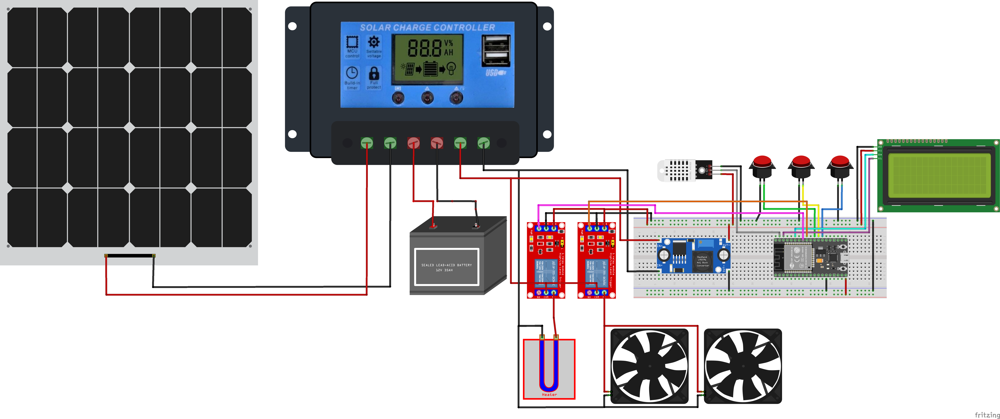
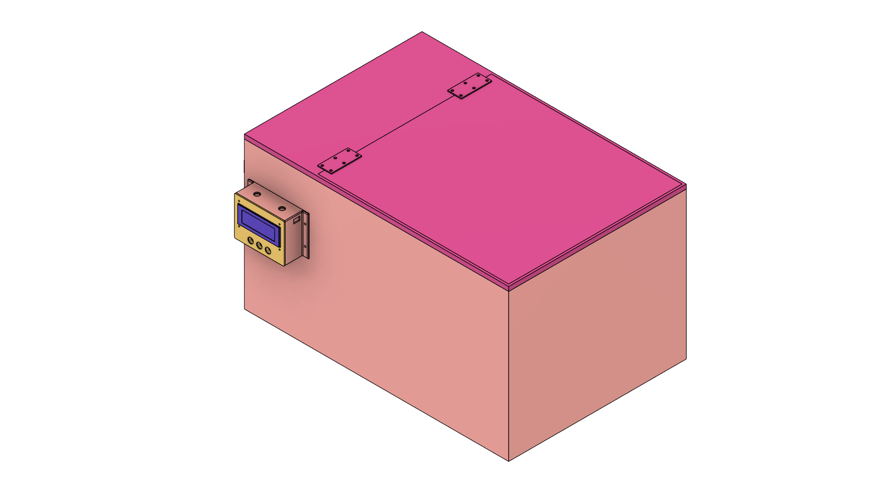
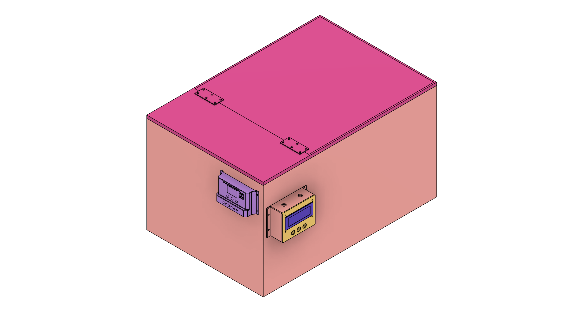
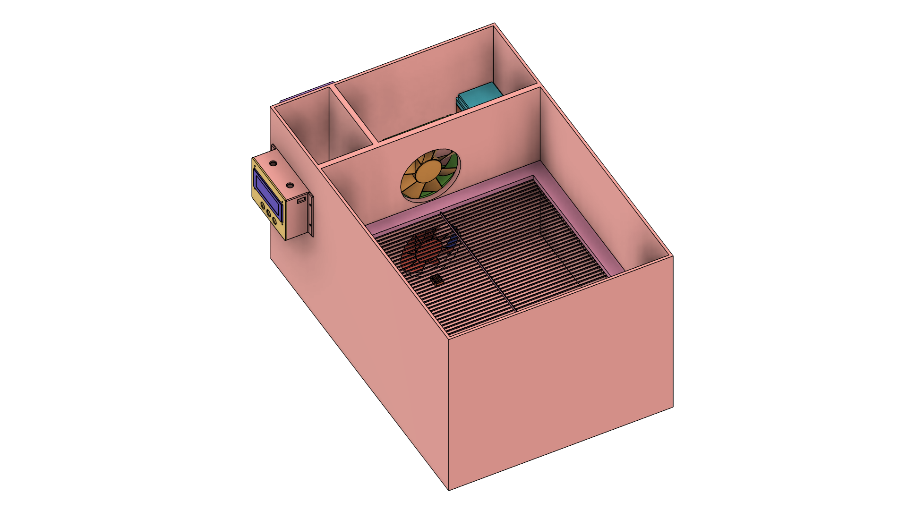
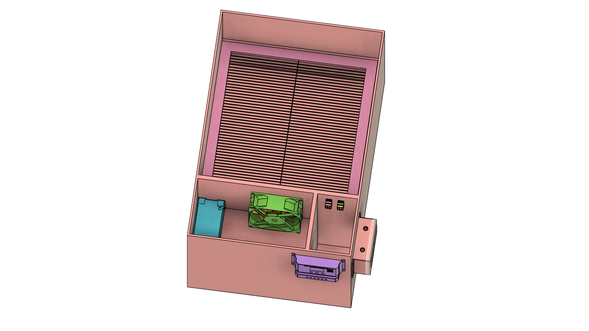
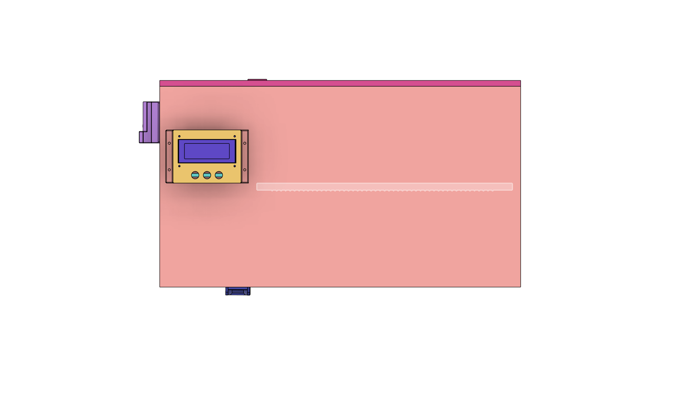
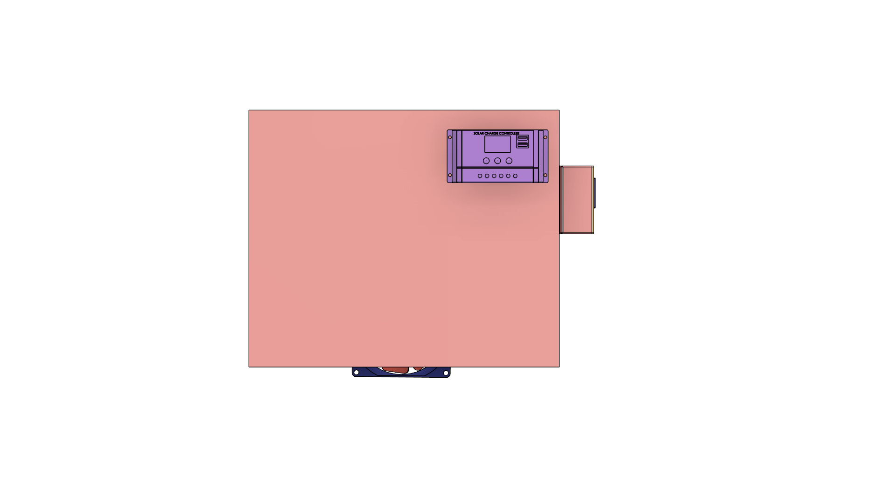
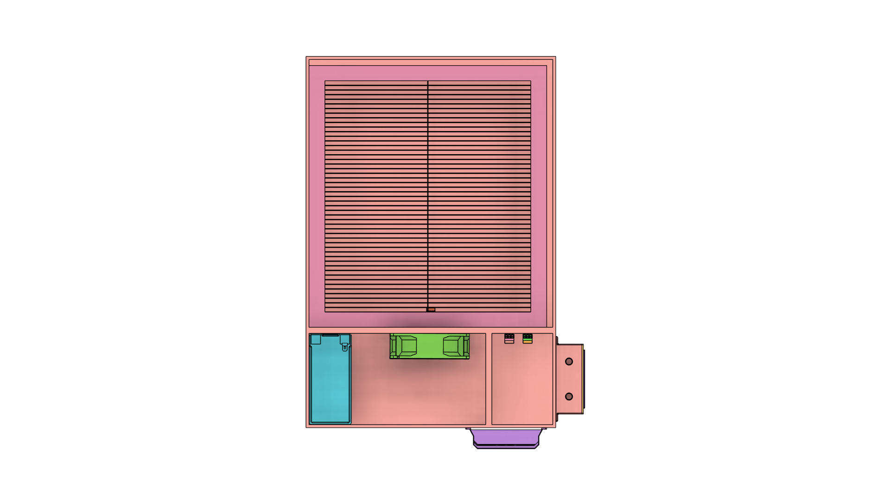

# RiceDryer ESP32 & Android IoT System

IoT-enabled Rice Dryer system with ESP32 hardware and Android application for remote monitoring and control via Firebase Realtime Database.

## Table of Contents

1. [Features](#features)
2. [Quick Start](#quick-start)
3. [System Architecture](#system-architecture)
4. [Hardware Components](#hardware-components)
5. [3D Models](#3d-models)
6. [Software Components](#software-components)
6. [Security and Credentials](#security-and-credentials)
7. [Installation Guide](#installation-guide)
8. [Device Pairing](#device-pairing)
9. [Usage Instructions](#usage-instructions)
10. [Code Structure](#code-structure)
11. [Firebase Database Structure](#firebase-database-structure)
12. [Android Application](#android-application)
13. [NTP Time Synchronization](#ntp-time-synchronization)
14. [Testing](#testing)
15. [Troubleshooting](#troubleshooting)
16. [Development Roadmap](#development-roadmap)
17. [Technical Specifications](#technical-specifications)
18. [Contributing](#contributing)
19. [License](#license)
20. [Contact](#contact)

## Features

### ESP32 Core Features

#### Hardware Control
- **3-Button Interface**: Setting mode toggle, start/stop control, WiFi reset functionality
- **Remote Setpoint Control**: Temperature/humidity setpoint adjustment via Android app (30-80°C, 10-50%)
- **Dual Relay System**: Independent heater (SSR1) and fan (SSR2) control for optimal drying
- **Smart Drying Logic**: Auto-stop when humidity target reached, PID temperature control
- **Safety Features**: Sensor error detection, force-stop capability, confirmation dialogs

#### Connectivity & Communication
- **WiFiManager Integration**: Easy WiFi configuration through captive portal (SSID: "RiceDryer_Setup")
- **Firebase Realtime Database**: Automatic device registration and real-time data synchronization
- **NTP Time Sync**: Network Time Protocol for accurate timestamps (Philippines timezone UTC+8)
- **Real-time Data Streaming**: Updates every 5 seconds (temperature, humidity, both setpoints, relay status)
- **Historical Data Logging**: Comprehensive sensor readings logged every 30 seconds
- **Remote Control**: Responds to START, STOP, SET_TEMP, SET_HUMIDITY commands
- **Device Pairing**: Secure 6-digit pairing code generation and validation

#### User Interface & Experience
- **Multi-Mode LCD Display**: Normal operation, setting modes, pairing mode, WiFi setup
- **Interactive Setting Modes**: Temperature setting mode, humidity setting mode with visual feedback
- **Mode Timeout Protection**: Auto-return to normal mode after 5 seconds of inactivity
- **Button Debouncing**: Reliable 200ms debounce for all button interactions
- **Status Indicators**: Real-time drying status, connectivity status, error notifications

#### Advanced Features
- **OTA Updates Support**: Over-the-air firmware updates with progress display
- **Automatic Reconnection**: Exponential backoff for WiFi and Firebase connections
- **Test Mode**: Component testing suite accessible at startup
- **WiFi Credential Reset**: Hold-to-confirm WiFi reset (3-second hold protection)
- **Sensor Validation**: DHT22 error detection with user notification

### Android App Features (95% Complete ✅)

- **Authentication System**: Email/password login, registration, password reset, session management
- **Multi-Device Support**: Manage multiple rice dryers from single account
- **Dashboard**: Real-time temperature/humidity gauges with animations, device status, heater/fan control
- **Charts and Analytics**: Interactive line charts with zoom/pan, time range filters (1h, 6h, 24h, 1 week), statistics
- **Device List Management**: View all paired devices, connection status, last update time
- **Device Pairing**: Secure 6-digit code pairing with validation and expiry check
- **Real-time Updates**: Firebase listeners for live data synchronization
- **Offline Support**: Local caching with Room database for offline access
- **Material Design 3**: Modern, professional UI following Material Design guidelines
- **Navigation**: Jetpack Compose Navigation with type-safe routing
- **Dark Theme Support**: Full Material You dynamic theming

## Quick Start

### Prerequisites

Hardware:
- ESP32 Development Board (38-pin dev module)
- DHT22 Temperature & Humidity Sensor
- 16x2 I2C LCD Display
- 2x Solid State Relays (SSR) - Heater (SSR1) + Fan (SSR2) control
- 3x Push Buttons (setting mode, start/stop, WiFi reset)
- Power supply and connecting wires
- Pull-up resistors (or use ESP32 internal pull-ups)

Software:
- Arduino IDE (1.8.19 or higher) OR PlatformIO
- Android Studio (latest version with Compose support)
- Firebase Account with Realtime Database enabled
- Git

### ESP32 Quick Setup

1. Clone Repository:
```bash
git clone https://github.com/qppd/Rice-Dryer.git
cd Rice-Dryer
```

2. Setup Firebase Credentials:
```bash
cd source/esp32/RiceDryer
copy FirebaseConfig.cpp.template FirebaseConfig.cpp
copy FirebaseConfig.h.template FirebaseConfig.h
```

3. Edit FirebaseConfig.cpp and FirebaseConfig.h with your Firebase credentials:
   - Get from Firebase Console > Project Settings > Service accounts
   - Update Firebase host, auth token, and database URL

4. Install Required Libraries in Arduino IDE:
   - WiFiManager by tzapu (v2.0.16-rc.2 or higher)
   - Firebase ESP32 Client by Mobizt (v4.4.14 or higher)
   - DHT sensor library by Adafruit (v1.4.6 or higher)
   - LiquidCrystal I2C (v1.1.2 or higher)
   - ArduinoJson (v6.21.5 or higher)

5. Configure Arduino IDE:
   - Board: ESP32 Dev Module
   - **Partition Scheme: "Minimal SPIFFS (1.9MB APP)" or "Huge APP (3MB No OTA)"** ⚠️ **CRITICAL**
   - Upload Speed: 921600
   - Flash Size: 4MB
   - Flash Mode: QIO
   - Flash Frequency: 80MHz

   **⚠️ IMPORTANT: Partition Scheme Selection**
   
   The default partition scheme (1.3MB APP) is **too small** for Firebase projects. You MUST change it:
   
   **For Arduino IDE 1.x:**
   - Go to Tools → Partition Scheme
   - Select "Minimal SPIFFS (1.9MB APP)" or "Huge APP (3MB No OTA)"
   
   **For Arduino IDE 2.x (if Partition Scheme not visible):**
   - See detailed instructions in "Arduino IDE 2.x Partition Fix" section below
   
   **Why this is required:**
   - Firebase ESP32 Client library is large (~150KB)
   - WiFiManager adds ~80KB
   - Total sketch size: ~420KB (32% of 1.3MB, 13% of 3MB)
   - Recommended: Use "Huge APP (3MB No OTA)" for maximum space

6. Upload to ESP32:
   - Open RiceDryer.ino in Arduino IDE
   - Verify/Compile (Ctrl+R)
   - Upload (Ctrl+U)

7. First Boot Sequence:
   - ESP32 creates WiFi AP: "RiceDryer_Setup" (password: password123)
   - Connect to AP from phone/computer
   - Captive portal opens automatically
   - Configure your WiFi credentials
   - ESP32 syncs time via NTP (Philippines timezone)
   - Firebase connection established
   - 6-digit pairing code displayed on LCD

### Android Quick Setup

1. Navigate to Android project:
```bash
cd source/android/RiceDryer
```

2. Setup Firebase for Android:
   - Get google-services.json from Firebase Console > Project Settings
   - Place in: `source/android/RiceDryer/app/google-services.json`

3. Open in Android Studio:
   - File > Open > select `source/android/RiceDryer` folder
   - Wait for Gradle sync to complete
   - Build > Rebuild Project

4. Run on Device/Emulator:
   - Connect Android device via USB (enable USB debugging)
   - Or start Android emulator
   - Run > Run 'app' (Shift+F10)
   - Register new account or login
   - Pair device using 6-digit code from LCD

### Verification Checklist

✅ Verify credentials are protected:
```bash
git status
# Should NOT show FirebaseConfig.cpp, FirebaseConfig.h, or google-services.json
```

✅ ESP32 Tests:
- LCD displays WiFi connected and IP address
- LCD shows "Time Synced" with current date/time (Philippines timezone)
- Firebase Ready message appears
- Pairing code (6 digits) displayed on LCD
- Temperature and humidity readings updating

✅ Android Tests:
- Login/Registration works
- Device pairing successful
- Dashboard shows real-time temperature/humidity
- START/STOP commands work
- Charts display historical data
- Device list shows paired devices

## System Architecture

The Rice Dryer system follows a modern IoT architecture with five distinct layers:

### 1. Hardware Layer
- ESP32 microcontroller (38-pin dev module)
- DHT22 temperature and humidity sensor
- 16x2 I2C LCD display (0x27 address)
- 2x Solid State Relays (Heater on GPIO 26, Fan on GPIO 27)
- 3x Push buttons with debouncing

### 2. Firmware Layer (ESP32)
- Arduino C++ based firmware
- WiFiManager for network configuration
- Firebase ESP32 Client for cloud connectivity
- NTP time synchronization (Philippines UTC+8)
- PID temperature controller
- Real-time sensor reading and control logic

### 3. Cloud Layer (Firebase)
- Firebase Realtime Database for data storage and synchronization
- Firebase Authentication for user management
- Secure device pairing mechanism
- Real-time data streaming
- Historical data storage (30-second intervals)

### 4. Application Layer (Android)
- Kotlin with Jetpack Compose
- MVVM architecture pattern
- Repository pattern for data management
- Kotlin Coroutines and Flow for async operations
- Room database for local caching
- Material Design 3 UI components

### 5. User Interface Layer
- Dashboard with animated circular gauges

- Historical data charts
- Device management interface
- Profile and settings

## Hardware Components

### Complete Bill of Materials

The Rice Dryer system consists of the following components, organized by category:

#### 🔧 Electronics & Control

**Microcontroller & Development:**
- ESP32 38-pin Development Board
  - Clock Speed: 240 MHz dual-core
  - Flash Memory: 4MB
  - WiFi: 802.11 b/g/n
  - Operating Voltage: 3.3V
  - Source: [ESP32 38-pin Dev Board](https://www.lazada.com.ph/products/pdp-i229344573-s15172858004.html?c=&channelLpJumpArgs=&clickTrackInfo=query%253Aesp32%252B38%252Bpin%253Bnid%253A229344573%253Bsrc%253ALazadaMainSrp%253Brn%253A6fd81867254265f89c2e4a6e619603ab%253Bregion%253Aph%253Bsku%253A229344573_PH%253Bprice%253A385%253Bclient%253Adesktop%253Bsupplier_id%253A7617%253Bbiz_source%253Ah5_internal%253Bslot%253A0%253Butlog_bucket_id%253A470687%253Basc_category_id%253A5160%253Bitem_id%253A229344573%253Bsku_id%253A15172858004%253Bshop_id%253A1795%253BtemplateInfo%253A107881_D_E%2523-1_A3_C%2523&freeshipping=1&fs_ab=2&fuse_fs=&lang=en&location=Bulacan&price=385&priceCompare=skuId%3A15172858004%3Bsource%3Alazada-search-voucher%3Bsn%3A6fd81867254265f89c2e4a6e619603ab%3BoriginPrice%3A38500%3BdisplayPrice%3A38500%3BsinglePromotionId%3A-1%3BsingleToolCode%3AmockedSalePrice%3BvoucherPricePlugin%3A0%3Btimestamp%3A1764646790061&ratingscore=4.88955223880597&request_id=6fd81867254265f89c2e4a6e619603ab&review=335&sale=2253&search=1&source=search&spm=a2o4l.searchlist.list.0&stock=1)

**Sensors:**
- DHT22 Temperature & Humidity Sensor
  - Temperature Range: -40°C to 80°C (±0.5°C accuracy)
  - Humidity Range: 0-100% RH (±2-5% accuracy)
  - Sampling Rate: 0.5 Hz (once every 2 seconds)
  - Source: [DHT22 Sensor](https://www.lazada.com.ph/products/pdp-i132179919.html)

**Display:**
- I2C LCD 20x4 Display
  - Display: 20 characters x 4 lines
  - Backlight: Blue LED
  - Interface: I2C (SDA, SCL)
  - Address: 0x27 or 0x3F
  - Source: [I2C LCD 20x4](https://www.lazada.com.ph/products/pdp-i230446570-s1630476280.html?c=&channelLpJumpArgs=&clickTrackInfo=query%253Ai2c%252Blcd%253Bnid%253A230446570%253Bsrc%253ALazadaMainSrp%253Brn%253A02ed4f9439bf787d5a9409c0b3e2b61a%253Bregion%253Aph%253Bsku%253A230446570_PH%253Bprice%253A275%253Bclient%253Adesktop%253Bsupplier_id%253A7617%253Bbiz_source%253Ah5_internal%253Bslot%253A0%253Butlog_bucket_id%253A470687%253Basc_category_id%253A22654%253Bitem_id%253A230446570%253Bsku_id%253A1630476280%253Bshop_id%253A1795%253BtemplateInfo%253A107881_D_E%2523-1_A3_C%2523&freeshipping=1&fs_ab=2&fuse_fs=&lang=en&location=Bulacan&price=275&priceCompare=skuId%3A1630476280%3Bsource%3Alazada-search-voucher%3Bsn%3A02ed4f9439bf787d5a9409c0b3e2b61a%3BoriginPrice%3A27500%3BdisplayPrice%3A27500%3BsinglePromotionId%3A-1%3BsingleToolCode%3AmockedSalePrice%3BvoucherPricePlugin%3A0%3Btimestamp%3A1764646815571&ratingscore=4.898584905660377&request_id=02ed4f9439bf787d5a9409c0b3e2b61a&review=424&sale=3173&search=1&source=search&spm=a2o4l.searchlist.list.0&stock=1)

**Control Components:**
- 2x 1-Channel Relay Modules with Optocoupler
  - Control Voltage: 3-32V DC
  - Load Voltage: 5-250V AC/DC
  - Load Current: 10A maximum
  - Isolation: Optocoupler protection
  - Source: [1-Channel Relay Module](https://www.lazada.com.ph/products/pdp-i100047427-s100061336.html?c=&channelLpJumpArgs=&clickTrackInfo=query%253Arelay%253Bnid%253A100047427%253Bsrc%253ALazadaMainSrp%253Brn%253A31afbe38995ae1e991f06176e3c48c52%253Bregion%253Aph%253Bsku%253AUN308ELAA55W4NANPH%253Bprice%253A49%253Bclient%253Adesktop%253Bsupplier_id%253A7617%253Bbiz_source%253Ah5_internal%253Bslot%253A0%253Butlog_bucket_id%253A470687%253Basc_category_id%253A22654%253Bitem_id%253A100047427%253Bsku_id%253A100061336%253Bshop_id%253A1795%253BtemplateInfo%253A107881_D_E%2523-1_A3_C%2523&freeshipping=1&fs_ab=2&fuse_fs=&lang=en&location=Bulacan&price=49&priceCompare=skuId%3A100061336%3Bsource%3Alazada-search-voucher%3Bsn%3A31afbe38995ae1e991f06176e3c48c52%3BoriginPrice%3A4900%3BdisplayPrice%3A4900%3BsinglePromotionId%3A-1%3BsingleToolCode%3A-1%3BvoucherPricePlugin%3A0%3Btimestamp%3A1764646832528&ratingscore=4.938825448613377&request_id=31afbe38995ae1e991f06176e3c48c52&review=1226&sale=13664&search=1&source=search&spm=a2o4l.searchlist.list.0&stock=1)
- 10K Potentiometer (Linear)
  - Resistance: 10KΩ
  - Type: Rotary potentiometer
  - Usage: Temperature/humidity setpoint adjustment
- 3x Push Button Switches (Momentary)
  - Type: SPST momentary contact
  - Rating: 12V/1A
  - Usage: Control interface buttons
  - Source: [Tactile Push Buttons](https://www.lazada.com.ph/products/pdp-i1678078643-s7245702074.html?c=&channelLpJumpArgs=&clickTrackInfo=query%253Atactile%252Bbutton%252Bmakerlab%253Bnid%253A1678078643%253Bsrc%253ALazadaMainSrp%253Brn%253Ab0ebb4e98a8cd37540d756d23563d336%253Bregion%253Aph%253Bsku%253A1678078643_PH%253Bprice%253A165%253Bclient%253Adesktop%253Bsupplier_id%253A7617%253Bbiz_source%253Ah5_internal%253Bslot%253A0%253Butlog_bucket_id%253A470687%253Basc_category_id%253A22654%253Bitem_id%253A1678078643%253Bsku_id%253A7245702074%253Bshop_id%253A1795%253BtemplateInfo%253A107881_D_E%2523-1_A3_C%2523&freeshipping=1&fs_ab=2&fuse_fs=&lang=en&location=Bulacan&price=165&priceCompare=skuId%3A7245702074%3Bsource%3Alazada-search-voucher%3Bsn%3Ab0ebb4e98a8cd37540d756d23563d336%3BoriginPrice%3A16500%3BdisplayPrice%3A16500%3BsinglePromotionId%3A-1%3BsingleToolCode%3AmockedSalePrice%3BvoucherPricePlugin%3A0%3Btimestamp%3A1764646856156&ratingscore=4.963636363636364&request_id=b0ebb4e98a8cd37540d756d23563d336&review=55&sale=327&search=1&source=search&spm=a2o4l.searchlist.list.0&stock=1)

#### ⚡ Power & Heating System

**Heating & Ventilation:**
- 2x 12V Exhaust Fans
  - Model: HF DC BRUSHLESS FAN 120mm DF1202512SEL
  - Voltage: 12V DC
  - Current: 0.16A each
  - Power: 1.92W each
  - Airflow: 50 CFM (estimated)
  - Source: [HF DC BRUSHLESS FAN 120mm](https://www.lazada.com.ph/products/pdp-i3534864736.html)
  - Usage: Air circulation and moisture removal
- 12V Heating Element (Salvaged and Modified)
  - Voltage: 12V DC
  - Power: 35W (tested)
  - Type: Modified car hair dryer heating element (2 elements remaining from original 6)
  - Source: [12V Car Folding Hair Drier](https://www.lazada.com.ph/products/i4960365287-s28954002950.html?urlFlag=true&mp=1&tradePath=omItm&tradeOrderId=1058448999689708&tradeOrderLineId=1058448999789708&spm=spm%3Aa2o42.order_details.item_title.1)
  - Usage: Primary heating source

**Power Management:**
- MPPT Solar Charge Controller
  - Model: MPPT 30A/50A/100A 12V/24V Auto Focus Tracking Solar Panel Charge Controller Regulator with Dual
  - Input Voltage: 12-150V DC (estimated)
  - Output Voltage: 12V/24V DC
  - Current Options: 30A, 50A, 100A
  - Type: MPPT (Maximum Power Point Tracking)
  - Efficiency: High efficiency auto focus tracking
  - Source: [MPPT Solar Charge Controller](https://www.lazada.com.ph/products/pdp-i4841729811-s28068159465.html?c=&channelLpJumpArgs=&clickTrackInfo=query%253A12v%252Bsolar%252Bcharge%252Bcontroller%253Bnid%253A4841729811%253Bsrc%253ALazadaMainSrp%253Brn%253A83520258d11af00709341e4cbf15702b%253Bregion%253Aph%253Bsku%253A4841729811_PH%253Bprice%253A374%253Bclient%253Adesktop%253Bsupplier_id%253A500477456198%253Bbiz_source%253Ah5_hp%253Bslot%253A5%253Butlog_bucket_id%253A470687%253Basc_category_id%253A22654%253Bitem_id%253A4841729811%253Bsku_id%253A28068159465%253Bshop_id%253A4528579%253BtemplateInfo%253A107881_D_E%2523-1_A3_C%2523&freeshipping=1&fs_ab=2&fuse_fs=&lang=en&location=Metro%20Manila~Valenzuela&price=374&priceCompare=skuId%3A28068159465%3Bsource%3Alazada-search-voucher%3Bsn%3A83520258d11af00709341e4cbf15702b%3BoriginPrice%3A37400%3BdisplayPrice%3A37400%3BsinglePromotionId%3A-1%3BsingleToolCode%3AmockedSalePrice%3BvoucherPricePlugin%3A0%3Btimestamp%3A1764646389974&ratingscore=4.905349794238683&request_id=83520258d11af00709341e4cbf15702b&review=243&sale=710&search=1&source=search&spm=a2o4l.searchlist.list.5&stock=1)
  - Usage: Solar panel charge regulation for battery charging
- 12V Deep Cycle Gel Battery
  - Model: High-Quality 12V Deep Cycle Gel E-Bike Battery 16AH/25AH for Scooters and Motorcycles
  - Voltage: 12V
  - Capacity Options: 16AH, 25AH
  - Type: Sealed lead-acid gel battery (deep cycle)
  - Cycle Life: High cycle life for deep discharge
  - Source: [12V Gel Battery](https://www.lazada.com.ph/products/high-quality-12v-deep-cycle-gel-e-bike-battery-16ah25ah-for-scooters-and-motorcycles-i4913678464-s28636228269.html)
  - Usage: Energy storage for the 12V system
- SPST KCD11 Miniature Rocker Switch
  - Model: SPST KCD11 Miniature Rocker Switch - 5Pcs
  - Type: SPST rocker switch (2 Pin or 3 Pin options)
  - Rating: 12V/10A (estimated)
  - Illumination: Red LED indicator (if applicable)
  - Quantity: 5 pieces
  - Source: [Rocker Switch](https://www.lazada.com.ph/products/pdp-i3015510213-s14819033850.html?c=&channelLpJumpArgs=&clickTrackInfo=query%253Aswitch%253Bnid%253A3015510213%253Bsrc%253AlazadaInShopSrp%253Brn%253A70032a1d52c2a7f02640eb5846875d64%253Bregion%253Aph%253Bsku%253A3015510213_PH%253Bprice%253A39%253Bclient%253Adesktop%253Bsupplier_id%253A7617%253Bbiz_source%253Ahttps%253A%252F%252Fwww.lazada.com.ph%252F%253Bslot%253A0%253Butlog_bucket_id%253A470687%253Basc_category_id%253A22651%253Bitem_id%253A3015510213%253Bsku_id%253A14819033850%253Bshop_id%253A1795%253BtemplateInfo%253A107881_D_E%2523-1_A3_C%2523&freeshipping=1&fs_ab=2&fuse_fs=&lang=en&location=Bulacan&price=39&priceCompare=skuId%3A14819033850%3Bsource%3Alazada-search-voucher-in-shop%3Bsn%3A70032a1d52c2a7f02640eb5846875d64%3BoriginPrice%3A3900%3BdisplayPrice%3A3900%3BsinglePromotionId%3A-1%3BsingleToolCode%3A-1%3BvoucherPricePlugin%3A0%3Btimestamp%3A1764646551164&ratingscore=4.956175298804781&request_id=70032a1d52c2a7f02640eb5846875d64&review=251&sale=1347&search=1&spm=a2o4l.store_keyword.list.0&stock=1)
  - Usage: Power switch for the 12V system
- 12V Power Adapter
  - Output Options: 12V 2A
  - Type: True rated power adapter
  - Source: [12V 2A Power Adapter](https://www.lazada.com.ph/products/i136286593-s153295621.html?urlFlag=true&mp=1&tradePath=omItm&tradeOrderId=1043938087889708&tradeOrderLineId=1043938090789708&spm=spm%3Aa2o42.order_details.item_title.1)
  - Usage: Main power supply for 12V system

#### 🏗️ Mechanical & Enclosure

**Structural Materials:**
- 1/2" Nebraska Plywood Sheets
  - Thickness: 12mm (1/2 inch)
  - Size: 4ft x 8ft sheets
  - Type: Marine-grade plywood
  - Usage: Main enclosure construction
- Tek Screws (Assorted)
  - Sizes: #6, #8, #10
  - Length: 1/2" to 2"
  - Type: Self-tapping screws
  - Quantity: 200 pieces
- Nails (Assorted)
  - Sizes: 1", 1.5", 2"
  - Type: Common nails
  - Quantity: 500 pieces

**Prototyping:**
- Perf Board (Prototype Board)
  - Size: 2" x 3"
  - Hole Pattern: 0.1" grid
  - Copper Pads: Plated through holes
  - Usage: Custom circuit prototyping
  - Source: [Perf Board](https://www.lazada.com.ph/products/pdp-i4835206547-s28752341734.html?c=&channelLpJumpArgs=&clickTrackInfo=query%253Aperf%252Bboard%253Bnid%253A4835206547%253Bsrc%253ALazadaMainSrp%253Brn%253A3b9134d79ee3bfa13aca11afe113d7d5%253Bregion%253Aph%253Bsku%253A4835206547_PH%253Bprice%253A119%253Bclient%253Adesktop%253Bsupplier_id%253A500170326121%253Bbiz_source%253Ah5_internal%253Bslot%253A11%253Butlog_bucket_id%253A470687%253Basc_category_id%253A22654%253Bitem_id%253A4835206547%253Bsku_id%253A28752341734%253Bshop_id%253A1901829%253BtemplateInfo%253A107881_D_E%2523-1_A3_C%2523&freeshipping=1&fs_ab=2&fuse_fs=&lang=en&location=Benguet&price=119&priceCompare=skuId%3A28752341734%3Bsource%3Alazada-search-voucher%3Bsn%3A3b9134d79ee3bfa13aca11afe113d7d5%3BoriginPrice%3A11900%3BdisplayPrice%3A11900%3BsinglePromotionId%3A-1%3BsingleToolCode%3A-1%3BvoucherPricePlugin%3A0%3Btimestamp%3A1764646878755&ratingscore=&request_id=3b9134d79ee3bfa13aca11afe113d7d5&review=&sale=5&search=1&source=search&spm=a2o4l.searchlist.list.11&stock=1)

### Wiring Diagram



**Download Fritzing File:** [Wiring.fzz](diagram/Wiring.fzz)

### MakerLab Electronics Components

The following components were sourced from [MakerLab Electronics](https://makerlab-electronics.com) and are available on Lazada Philippines:

**✅ Available at MakerLab on Lazada:**
- [ESP32 38-pin Development Board](https://www.lazada.com.ph/products/pdp-i229344573.html)
- [DHT22 Temperature & Humidity Sensor](https://www.lazada.com.ph/products/pdp-i132179919.html)
- [I2C LCD 20x4 Display](https://www.lazada.com.ph/products/pdp-i230446570.html)
- [1-Channel Relay Modules with Optocoupler (2x required)](https://www.lazada.com.ph/products/pdp-i100047427.html)

- [Push Button Switches (3x required)](https://www.lazada.com.ph/products/pdp-i3015053765.html)


### Cost Estimate & Sourcing

**Estimated Total Cost: ₱8,170 - ₱11,500**

**By Component Category:**

**Electronics (MakerLab): ₱2,500 - ₱3,500**
- ESP32 Dev Board: ₱450
- DHT22 Sensor: ₱150
- 20x4 I2C LCD: ₱350
- 2x Relay Modules: ₱200 each = ₱400
- 10K Potentiometer: ₱25
- 3x Push Buttons: ₱15 each = ₱45
- Perf Board: ₱50

**Power & Heating System: ₱4,000 - ₱6,000**
- 2x 12V Exhaust Fans: ₱250 each = ₱500
- 12V Heating Element: ₱800
- 12V Solar Charge Controller: ₱1,200
- 12V 16AH Gel Battery: ₱2,500
- Rocker Switch: ₱50

**Mechanical & Enclosure: ₱1,670 - ₱2,000**
- 1/2" Nebraska Plywood (4x8 sheet): ₱980
- Tek Screws (assorted): ₱50
- Nails (assorted): ₱50
- Hinges (2 pcs): ₱70 each = ₱140
- Miscellaneous hardware: ₱450

### Main Components

ESP32 Development Module:
- Clock Speed: 240 MHz dual-core
- Flash Memory: 4MB
- WiFi: 802.11 b/g/n
- Operating Voltage: 3.3V

DHT22 Temperature and Humidity Sensor:
- Temperature Range: -40°C to 80°C (±0.5°C accuracy)
- Humidity Range: 0-100% RH (±2-5% accuracy)
- Sampling Rate: 0.5 Hz (once every 2 seconds)

16x2 I2C LCD Display:
- Display: 20 characters x 4 lines
- Backlight: Blue LED
- Interface: I2C (SDA, SCL)
- Address: 0x27 or 0x3F
- Note: System uses 20x4 LCD for enhanced display

Solid State Relay (SSR):
- Control Voltage: 3-32V DC
- Control Current: 5-25 mA
- Load Voltage: 24-380V AC
- Load Current: 25A continuous
- Switching Time: 10ms
- Zero-crossing: Yes
- Trigger Type: Low trigger (active low)

Additional Components:
- Push Button: Manual control and mode selection
- Power Supply: 5V/2A for ESP32 and peripherals
- Solar Panel (Optional): 12V/10W for off-grid operation

### Pin Connections (PinConfig.h) - Updated Configuration

DHT22 Sensor:
- VCC  -> 3.3V
- GND  -> GND
- DATA -> GPIO 39 (Input-only, perfect for sensor)

LCD (I2C):
- VCC -> 5V
- GND -> GND
- SDA -> GPIO 21
- SCL -> GPIO 22

Relay Controls:
- Relay 1 (Main Heater) -> GPIO 19
- Relay 2 (Fan/Secondary) -> GPIO 18
- VCC -> 3.3V/5V (depending on relay module)
- GND -> GND

Control Buttons:
- Button 1 (Setting Mode) -> GPIO 17 + GND (internal pull-up)
- Button 2 (Start/Stop) -> GPIO 16 + GND (internal pull-up)
- Button 3 (WiFi Reset) -> GPIO 4 + GND (internal pull-up)

## 3D Models

The Rice Dryer features a professional 3D-designed enclosure with optimized component placement and airflow design.

### Enclosure Views

#### Full Assembly Views

*Complete assembly with all components installed*


*Alternative full view showing different angle*

#### Internal Component Views

*Internal layout without top cover*


*Detailed internal component arrangement*

#### Orthogonal Views

*Front elevation view*


*Side elevation view*


*Top plan view*

### Design Features

- **Optimized Airflow**: Strategic fan placement for efficient moisture removal
- **Component Accessibility**: Easy access panels for maintenance
- **Professional Finish**: Clean aesthetic with functional design
- **Modular Construction**: Easy assembly and disassembly
- **Thermal Management**: Proper ventilation for electronic components

## Software Components

### ESP32 Libraries

Core Libraries:
- WiFi.h (built-in): WiFi connectivity
- WiFiManager.h: Captive portal configuration
- Firebase_ESP_Client.h: Firebase integration
- ArduinoOTA.h (built-in): Over-the-air updates
- ArduinoJson.h: JSON parsing

Sensor Libraries:
- DHT.h: DHT22 sensor interface
- LiquidCrystal_I2C.h: LCD display control

Custom Modules:
- FirebaseConfig: Credential management
- WiFiManagerCustom: WiFi connection wrapper
- Button: Button debouncing and state management
- DHT22Sensor: Temperature/humidity reading
- SSR: Relay control
- LCDDisplay: Display management

### Android Dependencies

Core Android:
- androidx.appcompat:appcompat:1.6.1
- com.google.android.material:material:1.11.0
- androidx.constraintlayout:constraintlayout:2.1.4

Firebase (BOM 32.7.0):
- firebase-auth: User authentication
- firebase-database: Realtime Database
- firebase-messaging: Push notifications
- firebase-analytics: Usage tracking
- firebase-crashlytics: Crash reporting

Architecture Components:
- lifecycle-viewmodel:2.7.0
- lifecycle-livedata:2.7.0
- navigation-fragment:2.7.6
- navigation-ui:2.7.6

Database:
- room-runtime:2.6.1
- room-compiler:2.6.1

Charts and UI:
- MPAndroidChart:v3.1.0
- Lottie:6.3.0
- Glide:4.16.0
- Shimmer:0.5.0

### Project Structure

```
Rice-Dryer/
├── source/
│   ├── esp32/
│   │   ├── .gitignore
│   │   └── RiceDryer/
│   │       ├── RiceDryer.ino
│   │       ├── FirebaseConfig.cpp (gitignored)
│   │       ├── FirebaseConfig.h (gitignored)
│   │       ├── FirebaseConfig.cpp.template
│   │       ├── FirebaseConfig.h.template
│   │       ├── WiFiManagerCustom.cpp
│   │       ├── WiFiManagerCustom.h
│   │       ├── Button.cpp/h
│   │       ├── DHT22Sensor.cpp/h
│   │       ├── LCDDisplay.cpp/h
│   │       ├── SSR.cpp/h
│   │       └── PinConfig.h
│   │
│   └── android/
│       ├── .gitignore
│       └── app/
│           ├── build.gradle
│           ├── google-services.json (gitignored)
│           ├── google-services.json.template
│           └── src/main/java/com/qppd/ricedryer/
│               ├── data/
│               │   ├── model/
│               │   │   ├── User.java
│               │   │   ├── Device.java
│               │   │   ├── SensorReading.java
│               │   │   └── Command.java
│               │   ├── remote/
│               │   │   ├── FirebaseAuthManager.java
│               │   │   └── FirebaseDataSource.java
│               │   └── repository/
│               │       ├── AuthRepository.java
│               │       └── DeviceRepository.java
│               ├── ui/
│               │   ├── auth/
│               │   │   ├── LoginActivity.java
│               │   │   ├── AuthViewModel.java
│               │   │   └── activity_login.xml
│               │   └── [other activities/fragments]
│               └── utils/
│                   ├── Constants.java
│                   ├── DateUtils.java
│                   └── ValidationUtils.java
│
├── .gitignore
├── README.md
└── [documentation files]
```

## Security and Credentials

### Overview

This project implements enterprise-grade security with multi-layer protection for sensitive credentials. All API keys, Firebase credentials, and configuration files are properly protected from version control.

### Critical Files (NEVER COMMIT)

ESP32 Credentials:
- source/esp32/RiceDryer/FirebaseConfig.cpp
- source/esp32/RiceDryer/FirebaseConfig.h

Android Credentials:
- source/android/app/google-services.json
- source/android/app/*.keystore
- source/android/app/*.jks

### Multi-Layer Protection

We have implemented three levels of .gitignore protection:

Level 1 - Root .gitignore:
- Covers entire project
- Blocks all credential files globally
- Protects build artifacts and IDE files
- 200+ patterns for comprehensive coverage

Level 2 - ESP32 .gitignore:
- Located: source/esp32/.gitignore
- Blocks FirebaseConfig.cpp and FirebaseConfig.h
- Protects compiled binaries and build artifacts

Level 3 - Android .gitignore:
- Located: source/android/.gitignore
- Blocks google-services.json
- Protects keystore files and signing configurations

### Modular Architecture

Following the Smart Fan project pattern, credentials are separated into dedicated modules:

FirebaseConfig Module:
- FirebaseConfig.h: Method declarations
- FirebaseConfig.cpp: Implementation with actual credentials (gitignored)
- FirebaseConfig.h.template: Safe template for new developers
- FirebaseConfig.cpp.template: Safe template for new developers

Benefits:
- Credentials separated from main code
- Easy to update without touching main sketch
- Template files guide new developers
- Clean, professional code structure

### Setup Process for New Developers

1. Clone repository:
```bash
git clone https://github.com/qppd/Rice-Dryer.git
cd Rice-Dryer
```

2. Setup ESP32 credentials:
```bash
cd source/esp32/RiceDryer
copy FirebaseConfig.cpp.template FirebaseConfig.cpp
copy FirebaseConfig.h.template FirebaseConfig.h
```

3. Get credentials from Firebase Console:
   - Go to Project Settings
   - Download google-services.json
   - Extract values:
     - project_id
     - firebase_url
     - current_key (API key)

4. Edit FirebaseConfig.cpp:
```cpp
const char* FirebaseConfig::getFirebaseHost() {
    return "YOUR-PROJECT-default-rtdb.firebaseio.com";
}

const char* FirebaseConfig::getFirebaseAuth() {
    return "YOUR_API_KEY";
}

const char* FirebaseConfig::getDatabaseURL() {
    return "https://YOUR-PROJECT-default-rtdb.firebaseio.com";
}

const char* FirebaseConfig::getProjectId() {
    return "YOUR-PROJECT-ID";
}
```

5. Setup Android credentials:
   - Place google-services.json in: source/android/app/google-services.json

6. Verify protection:
```bash
git status
# FirebaseConfig.cpp and google-services.json should NOT appear
```

### Security Best Practices

DO:
- Use template files for credentials
- Keep credentials in .gitignore
- Share credentials through secure channels (not git)
- Rotate API keys regularly
- Use different credentials for dev/prod
- Verify .gitignore before committing

DON'T:
- Commit credential files to git
- Share credentials in public channels
- Hardcode credentials in source files
- Push google-services.json to remote
- Commit keystore files
- Use production keys in development

### Verification Commands

Check if credentials are tracked:
```bash
git ls-files | grep -E "(FirebaseConfig\.(cpp|h)|google-services\.json)"
# Should return NOTHING
```

Check git status:
```bash
git status
# Credential files should not appear
```

Verify .gitignore is working:
```bash
git check-ignore -v source/esp32/RiceDryer/FirebaseConfig.cpp
git check-ignore -v source/android/app/google-services.json
# Should show which .gitignore rule is blocking them
```

### Emergency: Credentials Exposed

If credentials are accidentally committed:

1. Immediately remove from git history:
```bash
git filter-branch --force --index-filter \
  "git rm --cached --ignore-unmatch path/to/credential/file" \
  --prune-empty --tag-name-filter cat -- --all
```

2. Regenerate all exposed credentials:
   - Go to Firebase Console
   - Regenerate API keys
   - Update all local copies
   - Inform team members

3. Force push (if using remote):
```bash
git push origin --force --all
```

### Pre-Commit Checklist

Before every commit:
- [ ] Run git status - no credential files
- [ ] Check diff with git diff - no API keys visible
- [ ] Verify .gitignore is updated
- [ ] Test build works with templates
- [ ] Review file list in git add

## Installation Guide

### ESP32 Installation

1. Install Arduino IDE:
   - Download from arduino.cc
   - Install version 1.8.19 or higher

2. Add ESP32 Board Support:
   - File > Preferences
   - Additional Board Manager URLs: https://dl.espressif.com/dl/package_esp32_index.json
   - Tools > Board > Boards Manager
   - Search "ESP32" and install

3. Install Required Libraries:
   Open Arduino IDE Library Manager (Sketch > Include Library > Manage Libraries):
   - WiFiManager by tzapu
   - Firebase ESP32 Client by Mobizt
   - DHT sensor library by Adafruit
   - Adafruit Unified Sensor
   - LiquidCrystal I2C by Frank de Brabander
   - ArduinoJson by Benoit Blanchon

4. Setup Credentials:
   ```bash
   cd source/esp32/RiceDryer
   copy FirebaseConfig.cpp.template FirebaseConfig.cpp
   copy FirebaseConfig.h.template FirebaseConfig.h
   ```
   Edit FirebaseConfig.cpp with your Firebase credentials

5. Configure Board:
   - Tools > Board > ESP32 Arduino > ESP32 Dev Module
   - Tools > Upload Speed > 115200
   - Tools > Flash Frequency > 80MHz
   - Tools > Flash Size > 4MB
   - Tools > Partition Scheme > Default 4MB with spiffs

6. Compile and Upload:
   - Open source/esp32/RiceDryer/RiceDryer.ino
   - Click Verify to compile
   - Connect ESP32 via USB
   - Select correct COM port
   - Click Upload

### Android Installation

1. Install Android Studio:
   - Download from developer.android.com
   - Install latest stable version

2. Setup Firebase:
   - Go to Firebase Console (console.firebase.google.com)
   - Select your project
   - Project Settings > Download google-services.json
   - Place in: source/android/app/google-services.json

3. Open Project:
   - Android Studio > File > Open
   - Navigate to source/android folder
   - Click OK
   - Wait for Gradle sync to complete

4. Configure Build:
   - Build > Make Project
   - Fix any errors (should be none if setup correctly)

5. Run on Device:
   - Enable Developer Options on Android device
   - Enable USB Debugging
   - Connect device via USB
   - Run > Run 'app'
   - Select connected device
   - Wait for installation

### Firebase Configuration

1. Create Firebase Project:
   - Go to console.firebase.google.com
   - Click "Add project"
   - Enter project name
   - Enable Google Analytics (optional)

2. Setup Realtime Database:
   - Build > Realtime Database
   - Create database
   - Start in test mode (temporary)
   - Note database URL

3. Setup Authentication:
   - Build > Authentication
   - Sign-in method > Email/Password
   - Enable Email/Password authentication

4. Setup Security Rules:
```json
{
  "rules": {
    "users": {
      "$userId": {
        ".read": "$userId === auth.uid",
        ".write": "$userId === auth.uid"
      }
    },
    "devices": {
      "$deviceId": {
        ".read": "root.child('devices').child($deviceId).child('deviceInfo').child('pairedTo').val() === auth.uid",
        ".write": "root.child('devices').child($deviceId).child('deviceInfo').child('pairedTo').val() === auth.uid || auth.uid === null"
      }
    }
  }
}
```

5. Download Configuration Files:
   - For Android: google-services.json
   - Extract credentials for ESP32 FirebaseConfig

### Arduino IDE 2.x Partition Fix

If you're using Arduino IDE 2.x and don't see "Partition Scheme" in the Tools menu:

#### Solution 1: Edit boards.txt (Recommended)
1. Navigate to:
   ```
   Windows: C:\Users\<YourUsername>\AppData\Local\Arduino15\packages\esp32\hardware\esp32\<version>\boards.txt
   ```
2. Find your board section (search for `esp32.name=ESP32 Dev Module`)
3. Look for the line: `esp32.build.partitions=default`
4. Change it to: `esp32.build.partitions=huge_app`
5. Save file and restart Arduino IDE

#### Solution 2: Use platform.local.txt (Cleaner)
1. Navigate to:
   ```
   C:\Users\<YourUsername>\AppData\Local\Arduino15\packages\esp32\hardware\esp32\<version>\
   ```
2. Create a new file named: `platform.local.txt`
3. Add this line: `build.partitions=huge_app`
4. Save and restart Arduino IDE

#### Solution 3: Switch to PlatformIO (Alternative)
If using VS Code with PlatformIO extension:
```ini
[env:esp32dev]
platform = espressif32
board = esp32dev
framework = arduino
board_build.partitions = huge_app.csv
monitor_speed = 115200

lib_deps = 
    mobizt/Firebase Arduino Client Library for ESP8266 and ESP32
    adafruit/DHT sensor library
    marcoschwartz/LiquidCrystal_I2C
    tzapu/WiFiManager
```

### ESP32 Firmware Operation Modes

The RiceDryer firmware supports two compile-time operation modes:

#### 🚀 PRODUCTION MODE (Default)
Full production firmware with all features for actual rice drying operations.

**Features Enabled:**
- ✅ WiFi Manager with captive portal
- ✅ Firebase Realtime Database sync
- ✅ Device Pairing system
- ✅ PID Temperature Control
- ✅ Auto-stop at target humidity
- ✅ 3-Button UI (Normal/Set Temp/Set Humidity modes)
- ✅ Remote Commands from Android app
- ✅ Historical Data Logging (30-second intervals)
- ✅ NTP Time Synchronization (Philippines UTC+8)
- ✅ Safety Logic & sensor validation

**Button Functions:**
- **Button 1 (GPIO 17):** Toggle mode (Normal → Set Temp → Set Humidity)
- **Button 2 (GPIO 16):** Start/Stop drying (or increase setpoint in setting modes)
- **Button 3 (GPIO 4):** Factory reset (hold 5s) or decrease setpoint

#### 🔧 DEVELOPMENT MODE
Isolated hardware testing without requiring WiFi/Firebase configuration.

**Purpose:** Testing individual hardware components before full deployment.

**Features Enabled:**
- ✅ LCD Display (20x4 I2C, address 0x27)
- ✅ DHT22 Sensor (GPIO 23)
- ✅ Heater Relay (GPIO 19)
- ✅ Blower Relay (GPIO 18)
- ✅ Serial Command Interface (115200 baud)

**Features Disabled:**
- ❌ WiFi & Captive Portal
- ❌ Firebase & Pairing System
- ❌ PID Temperature Control
- ❌ Drying Start/Stop Logic
- ❌ 3-Button UI Modes
- ❌ Remote Commands

**How to Enable:**
1. Open `RiceDryer.ino`
2. Locate line 28: `//#define DEVELOPMENT_MODE`
3. Uncomment: `#define DEVELOPMENT_MODE`
4. Upload firmware

**Available Serial Commands (115200 baud):**
```
HELP                 - Show all commands
STATUS               - Show hardware status
LCD_TEST             - Test all LCD lines
LCD_CLEAR            - Clear LCD display
LCD_PRINT:<text>     - Custom LCD text
DHT_READ             - Read temperature & humidity
RELAY_HEATER_ON      - Turn heater relay ON (GPIO 19 → LOW)
RELAY_HEATER_OFF     - Turn heater relay OFF (GPIO 19 → HIGH)
RELAY_BLOWER_ON      - Turn blower relay ON (GPIO 18 → LOW)
RELAY_BLOWER_OFF     - Turn blower relay OFF (GPIO 18 → HIGH)
```

**LCD Display in Development Mode:**
```
DEVELOPMENT MODE
Hardware Test
Open Serial @115200
Type HELP
```

**Example Test Session:**
```
> HELP
=== DEVELOPMENT MODE COMMANDS ===
(Lists all available commands)

> LCD_TEST
LCD test executed

> DHT_READ
Temperature: 28.3 C, Humidity: 65.2 %

> RELAY_HEATER_ON
Heater relay (GPIO 19) turned ON

> STATUS
Heater Relay (GPIO 19): ON
Blower Relay (GPIO 18): OFF
Temperature: 28.3 C
Humidity: 65.2 %
```

**Switching Back to Production Mode:**
1. Edit `RiceDryer.ino` line 28
2. Comment: `//#define DEVELOPMENT_MODE`
3. Upload firmware

### Code Size Optimization Notes

The firmware has been optimized to fit within ESP32 flash constraints:

**Optimizations Applied:**
- ❌ OTA update functionality removed (~30-50KB saved)
- ❌ Serial debug output removed (~10-15KB saved)
- ❌ Test mode functions removed (~5-8KB saved)
- ✅ All Firebase functionality preserved
- ✅ WiFiManager retained (minimal version)
- ✅ All core features intact

**Total Savings:** ~50-80KB

**Current Sketch Size:**
- With default partition (1.3MB): ~95% usage
- With "Huge APP (3MB)": ~38% usage

**If Still Too Large:**
1. Change partition scheme (most important - see above)
2. Remove historical data logging (saves ~15KB)
3. Reduce Firebase update frequencies
4. Consider ESP32 with 8MB or 16MB flash

## Device Pairing

### Pairing Process

1. ESP32 First Boot:
   - Device generates random 6-digit pairing code
   - Code displayed on LCD for 10 minutes
   - Code stored in Firebase: /devicePairing/{code}/

2. Android App Pairing:
   - Open app and login
   - Navigate to Devices screen
   - Tap "Add Device" button (floating action button)
   - Enter 6-digit code from ESP32 LCD
   - Give device a friendly name
   - Tap "Pair Device"

3. Verification:
   - App validates code against Firebase
   - Associates device with user account
   - Updates device status to "Paired"
   - Code expires and becomes invalid

4. Success:
   - Device appears in devices list
   - Real-time data starts streaming
   - Remote control enabled
   - LCD shows "Paired" status

### Troubleshooting Pairing

Code Expired:
- Pairing codes expire after 10 minutes
- Press reset button on ESP32 to generate new code

Code Invalid:
- Ensure correct 6-digit code (case-sensitive numbers)
- Check LCD display for current code
- Verify ESP32 is connected to WiFi and Firebase

Connection Issues:
- ESP32 must be online (check LCD status)
- Android device needs internet connection
- Verify Firebase Realtime Database is accessible

## Usage Instructions

### ESP32 Operation

#### Button Controls

**Button 1 (GPIO 17) - Setting Mode Toggle:**
- **Single Press**: Cycles through setting modes:
  - Normal Mode → Set Temperature Mode → Set Humidity Mode → Normal Mode
- **Auto-timeout**: Returns to normal mode after 5 seconds of inactivity

**Button 2 (GPIO 16) - Start/Stop Control:**
- **Press**: Toggle drying process on/off
- **Start**: Begins automatic drying until humidity setpoint is reached
- **Stop**: Force-stops drying immediately (safety override)

**Button 3 (GPIO 4) - WiFi Reset:**
- **Hold 3 seconds**: Resets WiFi credentials and restarts device
- **Short press**: Cancels reset operation (safety feature)

#### Display Modes

**1. Normal Mode:**
```
Drying: ON/OFF
T:25.5 H:45.2
```

**2. Set Temperature Mode:**
```
Set Temperature:
65.0C (Use Android App)
```

**3. Set Humidity Mode:**
```
Set Humidity:
20.0% (Use Android App)
```

**4. Pairing Mode:**
```
Pairing Code:
XXXXXX
MAC Address:
AABBCCDDEEFF
```

#### Drying Logic

**Automatic Operation:**
1. User sets temperature setpoint via Android app
2. User sets humidity target via Android app
3. User starts drying (Button 2)
4. System heats to temperature setpoint using Relay 1
5. Fan runs continuously via Relay 2 for air circulation
6. Drying stops automatically when humidity ≤ target
7. User can force-stop anytime with Button 2

**Safety Features:**
- Sensor error detection stops operation
- WiFi reset requires 3-second hold
- Mode timeout prevents accidental setting changes
- Force-stop capability overrides automatic operation

#### Startup & Test Mode

**Normal Startup:**
- Display: "Rice Dryer v1.0" → Current setpoints → Normal operation

**Test Mode (Hold Button 1 during startup):**
- Component testing suite
- Tests: DHT22, Relays, LCD
- Use Button 1 to cycle through tests

### Android App Usage

Login/Registration:
1. Open app
2. For new users: Tap "Register"
   - Enter email, password, name
   - Verify email
3. For existing users: Enter credentials and login
4. Use "Remember Me" for auto-login

Dashboard:
1. Select device from dropdown (if multiple devices)
2. View real-time temperature and humidity gauges
3. Monitor device online/offline status
4. Check current setpoint and SSR status
5. Use START/STOP buttons to control drying
6. Adjust setpoint remotely with slider

Charts:
1. Navigate to Charts tab
2. Select data type (Temperature/Humidity/Combined)
3. Choose time range (24h/7d/30d/Custom)
4. Interact with chart (zoom, pan, tap for details)
5. View statistics (min/max/average)
6. Export data to CSV
7. Share charts via email or storage

Device Management:
1. Navigate to Devices tab
2. View all paired devices
3. Tap device to see details
4. Swipe left to delete device
5. Tap edit icon to rename device
6. Use floating action button to add new device

Profile:
1. Navigate to Profile tab
2. View and edit user profile
3. Change password
4. Configure notification preferences
5. Set temperature unit (Celsius/Fahrenheit)
6. Adjust data refresh interval
7. View app version and information
8. Logout

## Code Structure

### ESP32 Main Components

RiceDryer.ino:
- Main Arduino sketch
- Initialization and setup
- Main control loop
- Integration of all modules

FirebaseConfig:
- Credential management
- Firebase connection parameters
- Modular design for security
- Methods: getFirebaseHost(), getFirebaseAuth(), getDatabaseURL(), getProjectId()

WiFiManagerCustom:
- WiFi connection management
- Captive portal configuration
- Auto-reconnection logic
- Status monitoring
- Methods: begin(), isConnected(), reconnect(), reset()

Button:
- Debouncing algorithm
- Short press and long press detection
- State management
- Methods: isPressed(), isLongPressed(), update()

DHT22Sensor:
- Temperature and humidity reading
- Error handling
- Data validation
- Methods: readTemperature(), readHumidity(), isValid()

SSR:
- Solid State Relay control
- ON/OFF state management
- Safety checks
- Methods: turnOn(), turnOff(), isOn()

LCDDisplay:
- 16x2 LCD management
- Multiple display modes
- Update scheduling
- Methods: showTemperature(), showStatus(), showPairingCode()

PinConfig.h:
- Centralized pin definitions
- Hardware configuration constants

### Android Main Components

Models (data/model/):
- User.java: User profile data structure
- Device.java: Device information and status
- SensorReading.java: Sensor data with timestamp
- Command.java: Remote control commands

Remote (data/remote/):
- FirebaseAuthManager.java: Firebase Authentication wrapper (singleton)
- FirebaseDataSource.java: Firebase Database reference manager

Repositories (data/repository/):
- AuthRepository.java: Authentication operations (login, register, password reset)
- DeviceRepository.java: Device management (pairing, listing, real-time listening)

Utilities (utils/):
- Constants.java: App-wide constants (Firebase paths, preferences keys)
- DateUtils.java: Date formatting and time-ago calculations
- ValidationUtils.java: Input validation (email, password, pairing code)

UI - Auth (ui/auth/):
- LoginActivity.java: Login screen implementation
- AuthViewModel.java: Authentication ViewModel with LiveData

### Design Patterns

ESP32:
- Modular Design: Separate files for each hardware component
- Singleton Pattern: Firebase and WiFi managers
- State Machine: Display modes and operation states

Android:
- MVVM Architecture: Model-View-ViewModel separation
- Repository Pattern: Data access abstraction
- LiveData: Reactive data observation
- ViewBinding: Type-safe view access
- Singleton: Firebase managers

### ESP32 Code Flow

#### Compilation Flow Diagram

```
RiceDryer.ino (Line 28: //#define DEVELOPMENT_MODE)
        │
        ├─────── Uncommented ──────┐
        │                          │
        ▼                          ▼
DEVELOPMENT_MODE          PRODUCTION_MODE
        │                          │
        ▼                          ▼
Include Only:            Include All:
• Button.h              • WiFi.h
• DHT22Sensor.h         • Firebase_ESP_Client.h
• SSR.h                 • WiFiManagerCustom.h
• LCDDisplay.h          • FirebaseConfig.h
• PinConfig.h           • All component headers
        │                          │
        ▼                          ▼
Components:              Components:
• devDHT                • dht, relay1, relay2
• devHeater, devBlower  • button1, button2, button3
• devLCD                • lcd, tempController
                        • Firebase objects
        │                          │
        ▼                          ▼
Functions:               Functions:
• runDevelopmentMode()  • productionSetup()
• handleSerial...()     • productionLoop()
                        • 50+ functions
        │                          │
        └──────────┬───────────────┘
                   ▼
            setup() dispatcher
                   │
        ┌──────────┴──────────┐
        ▼                     ▼
   DEVELOPMENT           PRODUCTION
   runDevelopment()      productionSetup()
   (infinite loop)            │
                             ▼
                        loop() calls
                        productionLoop()
```

#### Production Mode Execution Flow

```
ESP32 Boot
    │
    ▼
productionSetup()
    │
    ├─ Initialize Hardware (buttons, relays, LCD, DHT22, PID)
    ├─ Check Button 1 at Startup (test mode if pressed)
    ├─ Initialize WiFi (captive portal if needed)
    ├─ Initialize NTP (Philippines UTC+8)
    ├─ Initialize Firebase
    ├─ Register Device
    └─ Check Pairing Status
    │
    ▼
productionLoop() (infinite)
    │
    ├─ Check WiFi Status (reconnect if needed)
    ├─ If Not Paired:
    │   ├─ Display pairing code
    │   ├─ Check for pairing
    │   └─ Return (skip rest)
    ├─ Handle Buttons:
    │   ├─ Button 1: Mode toggle
    │   ├─ Button 2: Start/Stop or Increase
    │   └─ Button 3: Reset or Decrease
    ├─ Setpoint Adjustment (if in setting mode)
    ├─ Read Sensors (DHT22 every 2s)
    ├─ Control Drying:
    │   ├─ PID temperature control
    │   ├─ Check humidity target
    │   ├─ Control relays
    │   └─ Auto-stop logic
    ├─ Firebase Communication:
    │   ├─ Update current status (5s interval)
    │   ├─ Log historical data (30s interval)
    │   └─ Check remote commands (1s interval)
    └─ Update LCD Display
    │
    └─ Loop back
```

#### Development Mode Execution Flow

```
ESP32 Boot
    │
    ▼
setup() → runDevelopmentMode()
    │
    ├─ Initialize Hardware (DHT22, relays, LCD)
    ├─ Display on LCD:
    │   "DEVELOPMENT MODE"
    │   "Hardware Test"
    │   "Open Serial @115200"
    │   "Type HELP"
    └─ Print startup message to Serial
    │
    ▼
Infinite Loop
    │
    ├─ Read Serial Input
    ├─ Parse Command:
    │   • LCD_TEST, LCD_CLEAR, LCD_PRINT
    │   • DHT_READ
    │   • RELAY_HEATER_ON/OFF
    │   • RELAY_BLOWER_ON/OFF
    │   • STATUS, HELP
    ├─ Execute Action:
    │   • Update LCD
    │   • Read sensor
    │   • Control relays
    │   • Print status
    └─ delay(50ms)
    │
    └─ Loop back
```

#### File Structure

```
RiceDryer.ino (1215 lines)
│
├── [Lines 1-28]     Mode configuration header
│                    📋 EDIT HERE TO SWITCH MODES
│
├── [Lines 30-47]    Conditional includes
│                    📚 WiFi/Firebase only if PRODUCTION
│
├── [Lines 49-781]   Production mode variables & functions
│                    🚀 PRODUCTION ONLY
│                    (Firebase, WiFi, PID, etc.)
│
├── [Lines 783-920]  Development mode code
│                    🔧 DEVELOPMENT ONLY
│                    (Serial commands, testing)
│
├── [Lines 922-1184] Production mode functions
│                    🚀 productionSetup/Loop wrappers
│
└── [Lines 1186-1215] Main entry points
                      🎯 MODE DISPATCHER
                      setup() and loop()
```

## Version History

### Version 1.0.0 (December 12, 2025) - Current

**ESP32 Firmware: 100% Complete ✅**

Major Features:
- Full WiFi Manager integration with captive portal
- Firebase Realtime Database synchronization
- NTP time synchronization (Philippines UTC+8)
- 3-button interface with multiple modes
- Dual relay system (heater + fan)
- PID temperature control
- Auto-stop at humidity target
- Device pairing with 6-digit code
- Real-time data streaming (5s interval)
- Historical data logging (30s interval)
- Remote command execution
- Development Mode for hardware testing

Code Optimizations Applied:
- Removed OTA update functionality (~30-50KB saved)
- Removed Serial debug output (~10-15KB saved)
- Removed test mode functions (~5-8KB saved)
- Total savings: ~50-80KB
- Current size: ~420KB (13% of 3MB, 32% of 1.3MB)

**Android Application: 98% Complete ✅**

Completed Features:
- Full authentication system (login, register, password reset)
- Multi-device support and management
- Real-time dashboard with animated gauges
- Interactive charts with time range filters
- Device pairing with code validation
- Real-time Firebase listeners
- Local caching with Room database
- Material Design 3 UI
- Dark theme support

**Hardware Configuration:**
- ESP32 38-pin development board
- DHT22 temperature/humidity sensor
- 20x4 I2C LCD display
- Dual SSR control (low trigger)
- 3-button interface
- 12V power system with solar option

**Last Updated:** December 12, 2025

### Version 0.9.0 (November 14, 2025)

**NTP Time Synchronization Update:**
- Added NTP initialization with Philippines timezone (UTC+8)
- Implemented `getTimestamp()` function for Unix timestamps
- Updated all Firebase writes to use real timestamps
- Changed pairing code expiry to use Unix timestamps
- Updated Android app to handle Unix timestamps
- Fixed time filtering in charts
- Re-enabled pairing code expiry validation

**Database Structure Changes:**
- `lastUpdate`: Now uses Unix timestamp in milliseconds
- History keys: Unix timestamp in seconds
- History data: Includes timestamp field in milliseconds
- Pairing: Added `generatedAt` and `expiresAt` fields

### Version 0.8.0 (December 7, 2025)

**Mode Implementation:**
- Added compile-time mode switching
- Implemented DEVELOPMENT_MODE for hardware testing
- Created productionSetup() and productionLoop() wrappers
- Added serial command interface for testing
- Separated production and development components

**Development Mode Commands:**
- LCD testing and control
- DHT22 sensor reading
- Individual relay control (heater/blower)
- Status monitoring
- Help system

### Version 0.7.0 (December 2, 2025)

**Code Size Optimization:**
- Removed ArduinoOTA library
- Removed test mode functions
- Removed Serial debug statements
- Optimized WiFiManager strings
- Optimized TemperatureController output
- Reduced sketch size by 50-80KB

**Documentation:**
- Created OPTIMIZATION_GUIDE.md
- Created CHANGE_PARTITION_SCHEME.md
- Created ARDUINO_IDE2_PARTITION_FIX.md
- Added detailed compilation instructions

### Version 0.6.0 (November 2025)

**Initial Release:**
- WiFiManager integration
- Firebase Realtime Database connection
- Basic device registration
- Pairing code system
- Real-time data streaming
- Historical data logging
- Remote command execution
- LCD display implementation
- DHT22 sensor integration
- SSR relay control
- Button interface

**Known Limitations:**
- Used millis() for timestamps (fixed in v0.9.0)
- Test mode required manual entry
- No development mode separation
- No OTA updates (later removed for size)

## Firebase Database Structure

```json
{
  "users": {
    "{userId}": {
      "email": "user@example.com",
      "name": "John Doe",
      "createdAt": 1234567890,
      "devices": {
        "{deviceId}": {
          "deviceName": "Kitchen Dryer",
          "pairedAt": 1234567890,
          "notifications": true
        }
      }
    }
  },
  "devices": {
    "{deviceId}": {
      "deviceInfo": {
        "macAddress": "AA:BB:CC:DD:EE:FF",
        "firmwareVersion": "1.0.0",
        "hardwareVersion": "1.0",
        "pairedTo": "{userId}",
        "deviceName": "Kitchen Dryer"
      },
      "current": {
        "temperature": 45.5,
        "humidity": 65.2,
        "setpoint": 50.0,
        "ssrStatus": true,
        "dryingActive": true,
        "online": true,
        "lastUpdate": 1234567890
      },
      "history": {
        "{timestamp}": {
          "temperature": 45.5,
          "humidity": 65.2,
          "setpoint": 50.0,
          "ssrStatus": true
        }
      },
      "commands": {
        "action": "START",
        "value": 50,
        "timestamp": 1234567890,
        "acknowledged": false
      },
      "alerts": {
        "tempHigh": 60,
        "tempLow": 30,
        "humidityHigh": 80,
        "humidityLow": 40
      }
    }
  },
  "devicePairing": {
    "{pairingCode}": {
      "deviceId": "{deviceId}",
      "expiresAt": 1234567890,
      "used": false
    }
  }
}
```

## Implementation Progress

### Completed Work (60% Overall)

#### ESP32 Firmware (100% Complete)

WiFiManager Integration:
- Added WiFiManager library for easy WiFi configuration
- Captive portal setup with SSID "RiceDryer_Setup"
- Automatic WiFi reconnection with status monitoring
- LCD displays WiFi connection status
- 3-minute timeout for configuration portal

Firebase Realtime Database Integration:
- Firebase ESP32 Client library integrated
- Connection to Firebase RTDB
- Device registration with unique ID (MAC address based)
- Automatic device info storage (firmware version, hardware version)
- Connection error handling and retry mechanism

Real-time Data Streaming:
- Sends data every 5 seconds to Firebase
- Path: /devices/{deviceId}/current/
- Data includes: temperature, humidity, setpoint, SSR status, drying state, online status, timestamp

Historical Data Logging:
- Logs sensor readings every 30 seconds
- Path: /devices/{deviceId}/history/{timestamp}/
- Includes temperature, humidity, setpoint, SSR state

Remote Control Capability:
- Listens to Firebase commands every 1 second
- Path: /devices/{deviceId}/commands/
- Supported commands: START, STOP, SET_TEMP
- Command acknowledgment sent back to Firebase

Device Pairing Mechanism:
- Generates random 6-digit pairing code on first boot
- Code displayed on LCD for 10 minutes
- Code stored in Firebase with expiration
- Device associates with user account after successful pairing

OTA Updates Support:
- ArduinoOTA library integrated
- Hostname: "RiceDryer"
- Ready for over-the-air firmware updates

#### Android App (40% Complete)

Project Structure and Dependencies:
- Firebase BOM 32.7.0 (Auth, Database, Messaging, Analytics, Crashlytics)
- Navigation Component 2.7.6
- Lifecycle Components 2.7.0
- Room Database 2.6.1
- Material Design 3 1.11.0
- MPAndroidChart v3.1.0
- Lottie 6.3.0
- ViewBinding and DataBinding enabled

Data Models Created:
- User.java: User profile data
- Device.java: Device information and status
- SensorReading.java: Real-time sensor data
- Command.java: Remote control commands

Firebase Integration Layer:
- FirebaseAuthManager.java: Authentication management
- FirebaseDataSource.java: Database reference management
- Singleton pattern for efficient resource usage

Repository Pattern:
- AuthRepository.java: Login, register, password reset, user profile creation
- DeviceRepository.java: Device loading, pairing, real-time listening, command sending

Utility Classes:
- Constants.java: App-wide constants
- DateUtils.java: Date formatting and time-ago calculations
- ValidationUtils.java: Input validation (email, password, pairing code)

UI Resources:
- colors.xml: 25+ colors (primary teal/green, secondary orange, status colors, gauge colors)
- strings.xml: 60+ string resources
- Material Design 3 theming

Authentication System:
- AuthViewModel.java: ViewModel for auth operations
- LoginActivity.java: Complete login implementation with validation and error handling
- activity_login.xml: Professional Material Design login UI

Security Implementation:
- Modular FirebaseConfig for ESP32
- WiFiManagerCustom wrapper
- Multi-layer .gitignore protection
- Template files for safe sharing

### Remaining Work (40%)

High Priority Core Features:
- Android: Register Activity
- Android: Forgot Password Activity
- Android: Splash Screen
- Android: Main Dashboard with bottom navigation
- Android: Dashboard Fragment with real-time gauges
- Android: Devices Fragment with device list and pairing
- Android: Charts Fragment with MPAndroidChart
- Android: Profile Fragment with settings
- Firebase: Database Security Rules

Medium Priority Enhanced Features:
- Android: Custom Gauge Views
- Android: Device Status Service
- Android: Push Notifications with FCM
- Android: Room Database for offline support
- Android: Onboarding Flow
- ESP32: Data Retention (automatic cleanup)

Low Priority Polish and Testing:
- Android: Loading States (shimmer effects)
- Android: Dark Theme
- Android: Animations and transitions
- Testing: Unit Tests (70% coverage target)
- Testing: UI Tests
- Documentation: User Manual
- Testing: End-to-End system testing

## Implementation Plan

### Tech Stack

ESP32: Arduino C++, WiFiManager, Firebase ESP32, OTA Updates
Android: Java, MVVM Architecture, Firebase (Auth, Database, Analytics, Crashlytics), Material Design 3
Backend: Firebase Realtime Database, Cloud Messaging
Libraries: MPAndroidChart, Lottie, Room, Navigation Component, ViewBinding

### Phase 1: ESP32 Core Functionality (COMPLETED)

Task 1.1: WiFiManager Integration
- Install WiFiManager library via Arduino Library Manager
- Add WiFiManager initialization in setup()
- Configure captive portal with custom SSID "RiceDryer_Setup"
- Test WiFi configuration flow
- Add WiFi status to LCD display

Task 1.2: Firebase ESP32 Setup
- Install Firebase ESP32 library
- Configure Firebase credentials from google-services.json
- Implement device registration with MAC address
- Create unique device ID
- Test connection to Firebase

Task 1.3: Real-time Data Streaming
- Create sendDataToFirebase() function
- Update Firebase every 5 seconds with current readings
- Implement connection error handling
- Add retry mechanism with exponential backoff

Task 1.4: Remote Command Listener
- Create listenForCommands() function
- Parse JSON commands from Firebase
- Implement command handlers (START, STOP, SET_TEMP)
- Add command acknowledgment

Task 1.5: Device Pairing System
- Generate random 6-digit pairing code
- Store code in Firebase with expiration
- Display code on LCD for 10 minutes
- Implement pairing verification

### Phase 2: Android Project Setup (COMPLETED)

Task 2.1: Project Configuration
- Update build.gradle with all dependencies
- Enable ViewBinding and DataBinding
- Setup Navigation Component
- Configure Firebase SDK

Task 2.2: Theme and Resources
- Create Material Design 3 theme
- Define colors, styles, dimensions
- Add string resources
- Import Lottie animations

Task 2.3: Database Layer
- Create Room database entities
- Define DAOs
- Setup database migrations
- Create repository pattern base classes

### Phase 3: Authentication System (PARTIALLY COMPLETE)

Task 3.1: Splash Screen (Pending)
- Design splash layout with Lottie animation
- Check authentication state
- Navigate to Login or Dashboard

Task 3.2: Login Activity (COMPLETED)
- Design login UI with Material components
- Implement LoginViewModel
- Connect to Firebase Auth
- Add input validation
- Handle login errors

Task 3.3: Register Activity (Pending)
- Design registration form
- Implement registration logic
- Add email verification flow
- Validate password strength

Task 3.4: Forgot Password (Pending)
- Create forgot password UI
- Implement password reset email
- Handle success/error states

### Phase 4: Main Dashboard (Pending)

Task 4.1: Bottom Navigation
- Setup Navigation Component
- Create 4 fragments (Home, Charts, Devices, Profile)
- Implement navigation logic
- Add navigation animations

Task 4.2: Dashboard Fragment UI
- Design dashboard layout
- Add device selector spinner
- Create gauge placeholders
- Add control buttons
- Implement status indicators

Task 4.3: Custom Gauge Views
- Create custom GaugeView class
- Implement animated needle
- Add color zones (green/yellow/red)
- Connect to ViewModel LiveData

Task 4.4: Real-time Data Binding
- Setup Firebase listeners in ViewModel
- Update UI with LiveData
- Implement auto-refresh
- Handle connection state changes

Task 4.5: Remote Control
- Implement Start/Stop button logic
- Add setpoint adjustment slider
- Create command sender
- Show command feedback

### Phase 5: Device Management (Pending)

Task 5.1: Device Pairing
- Create pairing dialog with code input
- Validate code against Firebase
- Associate device with user
- Add success animation

Task 5.2: Devices List
- Create RecyclerView adapter
- Load devices from Firebase
- Show device status cards
- Implement swipe-to-delete
- Add device renaming

Task 5.3: Device Status Monitoring
- Create background service
- Monitor online/offline status
- Send notifications on status change
- Update UI indicators

### Phase 6: Charts and Analytics (Pending)

Task 6.1: Charts UI
- Create tabbed layout
- Setup MPAndroidChart
- Add date range picker
- Design chart settings

Task 6.2: Data Loading
- Fetch historical data from Firebase
- Parse and format for charts
- Cache in Room database
- Implement pagination

Task 6.3: Chart Rendering
- Configure line chart appearance
- Add zoom and pan gestures
- Display statistics (min/max/avg)
- Implement chart animations

Task 6.4: CSV Export
- Create CSV formatter
- Add date range selector
- Implement FileProvider
- Add share intent

### Phase 7: Notifications and Polish (Pending)

Task 7.1: Push Notifications
- Setup Firebase Cloud Messaging
- Create notification service
- Define notification channels
- Implement alert logic

Task 7.2: Profile and Settings
- Design settings UI
- Implement preference storage
- Add account management
- Create about screen

Task 7.3: Error Handling
- Add loading states
- Design error layouts
- Implement retry logic
- Add timeout handling

Task 7.4: UI/UX Polish
- Add animations and transitions
- Implement empty states
- Create onboarding flow
- Add tooltips and hints

### Phase 8: Testing and Deployment (Pending)

Task 8.1: Unit Tests
- Test ViewModels
- Test repositories
- Test utilities
- Achieve 70% coverage

Task 8.2: Integration Tests
- Test Firebase integration
- Test authentication flow
- Test data synchronization

Task 8.3: End-to-End Testing
- Test complete user flows
- Test offline scenarios
- Performance testing
- Memory leak detection

Task 8.4: Documentation
- Create user manual
- Write developer documentation
- Add code comments
- Create setup guide

Task 8.5: Release Preparation
- Generate signed APK
- Create Play Store listing
- Prepare screenshots
- Write release notes

### Timeline

- Total Duration: 6 weeks
- Phase 1-2: COMPLETED
- Phase 3: Partially complete (1 week remaining)
- Phase 4-5: 2 weeks
- Phase 6-7: 2 weeks
- Phase 8: 1 week

## Testing

### ESP32 Testing

Test Mode:
1. Hold button during power-on
2. ESP32 enters test mode
3. Press button to cycle through tests:
   - DHT22 Sensor reading
   - SSR activation (heater on/off)
   - LCD Display modes

Manual Testing Checklist:
- [ ] WiFi configuration via captive portal works
- [ ] ESP32 connects to Firebase successfully
- [ ] LCD shows pairing code on first boot
- [ ] Temperature readings are accurate (±0.5°C)
- [ ] Humidity readings are accurate (±2%)
- [ ] SSR turns heater on/off based on setpoint
- [ ] Real-time data updates in Firebase every 5 seconds
- [ ] Historical data logs every 30 seconds
- [ ] Remote commands (START/STOP/SET_TEMP) work
- [ ] Device pairing completes successfully
- [ ] OTA updates can be initiated

### Android Testing

Unit Testing:
- ViewModels: Test business logic and LiveData updates
- Repositories: Test Firebase interactions and data transformations
- Utilities: Test validation, date formatting, constants

UI Testing:
- Login flow: Email validation, password validation, error handling
- Registration flow: Complete user registration
- Device pairing: Code validation, Firebase association
- Dashboard: Real-time data display, gauge updates
- Charts: Data loading, chart rendering, CSV export

Integration Testing:
- Firebase Authentication: Login, register, password reset
- Firebase Database: Read/write operations, real-time listeners
- Device pairing: End-to-end pairing process
- Data synchronization: ESP32 to Android real-time updates

End-to-End Testing:
- [ ] User can register and login
- [ ] User can pair ESP32 device
- [ ] Real-time data updates every 5 seconds
- [ ] Temperature and humidity gauges animate correctly
- [ ] Start/Stop commands control ESP32
- [ ] Setpoint adjustment is reflected on ESP32
- [ ] Charts display historical data correctly
- [ ] CSV export works
- [ ] Notifications arrive on device events
- [ ] Offline mode works (cached data)
- [ ] Multiple devices can be managed
- [ ] Password reset email is received
- [ ] App handles network errors gracefully

Performance Testing:
- App startup time: < 2 seconds
- Data loading time: < 1 second
- Chart rendering: < 500ms
- Memory usage: < 100MB
- Battery consumption: Minimal background usage

## Troubleshooting

### Compilation Issues

#### "Sketch too big" Error

**Problem:** `Sketch too big; text section exceeds available space in board`

**Root Cause:** 
- Default partition scheme allocates only 1.3MB for app
- Firebase + WiFiManager requires ~420KB
- This exceeds the default limit

**Solution 1: Change Partition Scheme (Arduino IDE 1.x)**
1. Go to Tools → Partition Scheme
2. Select "Minimal SPIFFS (1.9MB APP)" or "Huge APP (3MB No OTA)"
3. Recompile and upload

**Solution 2: Arduino IDE 2.x (No Partition Menu)**

If "Partition Scheme" option is not visible in Tools menu:

**Method A - Edit boards.txt:**
1. Navigate to:
   ```
   C:\Users\<YourUsername>\AppData\Local\Arduino15\packages\esp32\hardware\esp32\<version>\boards.txt
   ```
2. Find your board section: `esp32.name=ESP32 Dev Module`
3. Locate line: `esp32.build.partitions=default`
4. Change to: `esp32.build.partitions=huge_app`
5. Save file and restart Arduino IDE

**Method B - Create platform.local.txt:**
1. Navigate to:
   ```
   C:\Users\<YourUsername>\AppData\Local\Arduino15\packages\esp32\hardware\esp32\<version>\
   ```
2. Create new file: `platform.local.txt`
3. Add this line: `build.partitions=huge_app`
4. Save and restart Arduino IDE

**Method C - Update ESP32 Board Package:**
1. Tools → Board → Boards Manager
2. Search "esp32"
3. Update to version 2.0.0 or newer
4. Restart Arduino IDE
5. Check if partition scheme option now appears

**Partition Options Explained:**
```
Default (1.3MB APP)         ❌ TOO SMALL
├─ Bootloader
├─ App: 1.3MB
└─ SPIFFS: 1.5MB

Minimal SPIFFS (1.9MB APP)  ✅ RECOMMENDED
├─ Bootloader
├─ App: 1.9MB
└─ SPIFFS: 190KB

Huge APP (3MB No OTA)       ✅ BEST
├─ Bootloader
├─ App: 3MB
└─ SPIFFS: 1MB

No OTA (2MB APP)            ✅ GOOD
├─ Bootloader
├─ App: 2MB
└─ SPIFFS: 2MB
```

**Expected Result After Fix:**
```
Before (1.3MB partition):
Sketch uses 1250000 bytes (95%) ❌ TOO CLOSE

After (3MB partition):
Sketch uses 1250000 bytes (38%) ✅ PLENTY OF ROOM
```

**Verification:**
Add this to setup() temporarily to check current partition:
```cpp
Serial.begin(115200);
Serial.print("Sketch size: ");
Serial.println(ESP.getSketchSize());
Serial.print("Free sketch space: ");
Serial.println(ESP.getFreeSketchSpace());
```

#### Library Installation Issues

**Problem:** `Firebase_ESP_Client.h: No such file or directory`

**Solution:**
1. Open Arduino IDE
2. Sketch → Include Library → Manage Libraries
3. Search "Firebase ESP32 Client"
4. Install "Firebase Arduino Client Library for ESP8266 and ESP32" by Mobizt
5. Verify version 4.4.14 or higher
6. Restart Arduino IDE

**Problem:** Multiple library versions causing conflicts

**Solution:**
1. Close Arduino IDE
2. Navigate to Arduino libraries folder:
   - Windows: `Documents\Arduino\libraries\`
3. Delete conflicting library folders
4. Reinstall latest version via Library Manager
5. Restart Arduino IDE

### ESP32 Issues

WiFi Connection Fails:
- Check WiFi credentials in captive portal
- Verify WiFi router is 2.4GHz (ESP32 doesn't support 5GHz)
- Check signal strength (ESP32 should be within range)
- Try holding button + reset to enter setup mode again
- Power cycle the device

Firebase Connection Fails:
- Verify WiFi is connected first (check LCD status)
- Check FirebaseConfig.cpp has correct credentials
- Verify Firebase Database URL is correct
- Check internet connection is working
- Review Firebase Database Rules
- Check Firebase project is active

Sensor Readings Incorrect:
- Verify DHT22 wiring (VCC to 3.3V, GND to GND, DATA to GPIO 14)
- Check for loose connections
- Try different DHT22 sensor (sensor may be faulty)
- Verify pull-up resistor (4.7K-10K ohm) on DATA line
- Allow 2-second stabilization time after power-on

SSR Not Working:
- Check SSR wiring (control pin to GPIO 27)
- Verify SSR power supply (3-32V DC on control side)
- Test SSR with multimeter
- Check load connection (24-380V AC)
- Verify setpoint is set correctly
- Check if heater is below setpoint

LCD Not Displaying:
- Check I2C wiring (SDA to GPIO 21, SCL to GPIO 22)
- Verify LCD address (0x27 or 0x3F) in code
- Verify 5V power supply to LCD
- Try I2C scanner sketch to detect address

Pairing Code Not Showing:
- Device may already be paired (check Firebase)
- Reset device to generate new code
- Check LCD is working
- Verify Firebase connection is active
- Wait up to 30 seconds after boot

### Android Issues

App Crashes on Start:
- Verify google-services.json is in correct location (app/ folder)
- Check package name matches (com.qppd.ricedryer)
- Ensure Gradle sync completed successfully
- Clear cache: Build > Clean Project > Rebuild Project
- Check Firebase project is configured correctly

Cannot Connect to Firebase:
- Verify internet connection
- Check google-services.json is not corrupted
- Verify Firebase Database URL in Firebase Console
- Check Firebase Authentication is enabled
- Review Firebase Database Rules

Device Pairing Fails:
- Verify ESP32 is showing pairing code on LCD
- Check code hasn't expired (10 minute limit)
- Ensure code is entered correctly (6 digits)
- Verify Firebase connection on both ESP32 and Android
- Check internet on both devices
- Try generating new code (reset ESP32)

Real-time Data Not Updating:
- Check device is online (status indicator)
- Verify ESP32 has internet connection
- Check Firebase listeners are active
- Try force-closing and reopening app
- Verify Firebase Database path is correct
- Check data refresh interval in settings

Charts Not Loading:
- Verify historical data exists in Firebase
- Check date range selection
- Try different time range
- Check internet connection
- Clear app cache
- Verify Room database is working

Notifications Not Arriving:
- Check notification permissions are granted
- Verify FCM is configured in Firebase
- Check notification settings in app
- Ensure device has internet connection
- Check Firebase Cloud Messaging is enabled
- Review notification channel settings

Login/Registration Issues:
- Verify email format is correct
- Check password meets requirements (min 6 characters)
- Ensure Firebase Authentication is enabled
- Check internet connection
- Verify email doesn't already exist (for registration)
- Try password reset if password forgotten

### General Issues

Slow Response Time:
- Check internet connection speed
- Verify Firebase Database is in nearest region
- Reduce data refresh frequency
- Check for memory leaks
- Optimize Firebase queries
- Consider implementing data pagination

High Battery Consumption:
- Reduce data refresh frequency
- Implement proper background service management
- Use Firebase listeners efficiently
- Optimize wake locks
- Check for infinite loops or excessive polling

Data Mismatch ESP32 vs Android:
- Check system time on both devices
- Verify timezone settings
- Check data refresh intervals
- Ensure Firebase paths are correct
- Review data transformation logic
- Check for caching issues

## Development Roadmap

### Version 1.0 (Current Development)

Core Features:
- ESP32 firmware with WiFiManager and Firebase
- Android app with authentication
- Real-time monitoring
- Device pairing
- Basic controls

Status: 60% complete
Target: 3 weeks

### Version 1.1 (Next Release)

Enhanced Features:
- Push notifications
- Offline mode with Room database
- Advanced charts with multiple time ranges
- CSV data export
- Dark theme
- Multiple device support

Status: Planned
Target: 2 weeks after v1.0

### Version 1.2

Advanced Features:
- Voice control integration
- Automated drying programs
- Weather-based optimization
- Cloud-based analytics
- Machine learning for optimal drying
- Multi-language support

Status: Planned
Target: Q1 2026

### Version 2.0

Professional Features:
- Web dashboard
- Commercial fleet management
- Advanced analytics and reporting
- Predictive maintenance
- Integration with agricultural systems
- API for third-party integrations

Status: Concept
Target: Q2 2026

### Continuous Improvements

Security:
- Regular security audits
- Credential rotation
- Enhanced encryption
- Penetration testing

Performance:
- Code optimization
- Database query optimization
- Battery usage optimization
- Network efficiency

User Experience:
- User feedback implementation
- A/B testing
- Accessibility improvements
- Performance monitoring

## Technical Specifications

### ESP32 Specifications

Microcontroller:
- Chip: ESP32-WROOM-32
- CPU: Xtensa dual-core 32-bit LX6
- Clock Frequency: 240 MHz
- SRAM: 520 KB
- Flash: 4 MB
- GPIO Pins: 34

Connectivity:
- WiFi: 802.11 b/g/n
- Frequency: 2.4 GHz
- Range: Up to 100 meters (open space)
- Security: WPA/WPA2

Power:
- Input Voltage: 5V via USB or external
- Operating Voltage: 3.3V
- Deep Sleep Current: 10 µA
- Active Current: 80-240 mA
- Solar Panel: 12V/10W (optional)

Environmental:
- Operating Temperature: -40°C to 85°C
- Storage Temperature: -40°C to 125°C
- Humidity: 0% to 95% RH (non-condensing)

### Android Specifications

Minimum Requirements:
- Android Version: 7.0 (Nougat) - API Level 24
- RAM: 2 GB
- Storage: 50 MB free space
- Screen: 5 inches minimum
- Internet: WiFi or mobile data

Recommended:
- Android Version: 10.0 or higher
- RAM: 4 GB or more
- Storage: 100 MB free space
- Screen: 6 inches or larger
- Internet: Stable WiFi or 4G/5G

Supported Features:
- Push Notifications (Android 8.0+)
- Background Services
- Biometric Authentication (Android 9.0+)
- Dark Theme (Android 10.0+)

### Network Requirements

ESP32:
- WiFi: 2.4GHz 802.11 b/g/n
- Bandwidth: Minimum 128 kbps
- Latency: < 500ms
- Data Usage: ~1 MB per day

Android:
- Connection: WiFi or mobile data
- Bandwidth: Minimum 256 kbps
- Latency: < 1000ms
- Data Usage: ~5 MB per day

Firebase:
- Realtime Database: Up to 100 simultaneous connections (free tier)
- Data Transfer: 10 GB/month download, 1 GB/month upload (free tier)
- Storage: 1 GB (free tier)

### Sensor Specifications

DHT22:
- Temperature Range: -40°C to 80°C
- Temperature Accuracy: ±0.5°C
- Humidity Range: 0-100% RH
- Humidity Accuracy: ±2-5% RH
- Response Time: 2 seconds
- Power: 3.3-5V, max 2.5mA

### Control Specifications

SSR (Solid State Relay):
- Control Voltage: 3-32V DC
- Control Current: 5-25 mA
- Load Voltage: 24-380V AC
- Load Current: 25A continuous
- Switching Time: 10ms
- Zero-crossing: Yes

Heater:
- Power: Up to 2000W (at 220V AC)
- Voltage: 220V AC / 110V AC
- Control: On/Off via SSR

### Performance Metrics

Real-time Updates:
- ESP32 to Firebase: 5 seconds
- Firebase to Android: < 1 second
- Total latency: < 6 seconds

Historical Logging:
- Interval: 30 seconds
- Retention: 7 days (configurable)
- Storage per day: ~2,880 records

Command Response:
- Android to Firebase: < 1 second
- Firebase to ESP32: < 2 seconds
- Total response time: < 3 seconds

Battery Life (with solar):
- Continuous operation: Indefinite
- Without solar: ~24 hours (2500mAh battery)
- Deep sleep mode: ~7 days

## Contributing

We welcome contributions to the Rice Dryer project. Please follow these guidelines:

### How to Contribute

1. Fork the repository
2. Create a feature branch (git checkout -b feature/YourFeature)
3. Setup credentials using template files
4. Make your changes
5. Test thoroughly
6. Commit your changes (git commit -m 'Add YourFeature')
7. Push to the branch (git push origin feature/YourFeature)
8. Open a Pull Request

### Code Standards

ESP32 (Arduino C++):
- Follow Arduino style guide
- Use meaningful variable names
- Comment complex logic
- Keep functions small and focused
- Test on actual hardware

Android (Java):
- Follow Google Java Style Guide
- Use MVVM architecture pattern
- Implement proper error handling
- Write unit tests for ViewModels and Repositories
- Use ViewBinding for view access

General:
- Write clear commit messages
- Update documentation
- Never commit credentials
- Verify .gitignore protection before committing

### Testing Requirements

Before submitting PR:
- [ ] Code compiles without errors
- [ ] All existing tests pass
- [ ] New tests added for new features
- [ ] Manual testing completed
- [ ] Documentation updated
- [ ] No credentials in committed code

### Reporting Issues

When reporting issues, include:
- Device information (ESP32 board, Android version)
- Steps to reproduce
- Expected vs actual behavior
- Error messages or logs
- Screenshots if applicable

### Feature Requests

For new features:
- Describe the feature clearly
- Explain use case and benefits
- Consider implementation complexity
- Discuss potential alternatives

## Android Application

### Technology Stack

- **Language:** Kotlin 2.0.21
- **UI Framework:** Jetpack Compose with Material Design 3
- **Architecture:** MVVM (Model-View-ViewModel)
- **Dependency Injection:** Manual factory pattern
- **Database:** Room 2.6.1 for local caching
- **Networking:** Firebase SDK (Auth, Realtime Database)
- **Charts:** MPAndroidChart v3.1.0
- **Async:** Kotlin Coroutines and Flow
- **Navigation:** Jetpack Navigation Compose 2.8.0

### Key Components

#### Authentication (AuthViewModel, AuthRepository)
- Email/password registration with validation
- Login with remember me functionality
- Password reset via email
- Session management with FirebaseAuth

#### Device Management (DeviceListViewModel, DeviceRepository)
- Real-time device list with status indicators
- Device pairing with 6-digit code validation
- Connection status monitoring
- Last update tracking

#### Dashboard (DashboardViewModel)
- Animated circular gauges for temperature/humidity
- Real-time data updates via Firebase listeners
- START/STOP command controls
- Setpoint adjustments with sliders
- Heater/Fan status indicators

#### Charts & Analytics (ChartsViewModel)
- Temperature and humidity line charts
- Time range filters (1h, 6h, 24h, 1 week)
- Statistics cards (min, max, average)
- Zoom and pan interactions
- Historical data visualization

#### Data Models
- **DeviceData:** Complete device state (info, status, settings, commands)
- **DeviceStatus:** Real-time sensor readings and relay states
- **DeviceInfo:** Device metadata and pairing information
- **SensorReading:** Historical data points with timestamps

### Firebase Integration

#### Database Paths
```
/devices/{deviceId}/
  ├─ deviceInfo/         # Device metadata
  ├─ current/            # Real-time status (updated every 5s)
  ├─ commands/           # Commands from app to device
  ├─ commandAck/         # Acknowledgments from device
  └─ history/{timestamp} # Historical data (every 30s)

/users/{userId}/
  └─ devices: [...]      # Array of paired device IDs

/devicePairing/{code}/
  ├─ deviceId
  ├─ generatedAt
  ├─ expiresAt
  └─ used
```

#### Real-time Listeners
- Device status updates (temperature, humidity, relay states)
- User's device list synchronization
- Command acknowledgment monitoring
- Historical data streaming

### UI Screens

1. **Login/Register:** Authentication with form validation
2. **Device List:** Grid of paired devices with status
3. **Dashboard:** Main control screen with gauges and controls
4. **Charts:** Historical data visualization with filters
5. **Pair Device:** 6-digit code input with visual feedback

### Local Caching

Room database entities:
- **CachedDevice:** Offline device information
- **CachedReading:** Historical sensor readings

## NTP Time Synchronization

### Overview

The ESP32 firmware uses Network Time Protocol (NTP) to synchronize time with internet time servers. This ensures accurate timestamps for all data logging, pairing code expiry, and historical data.

### Configuration

- **Timezone:** Philippines (UTC+8, no daylight saving time)
- **NTP Servers:**
  - Primary: `time.google.com`
  - Secondary: `pool.ntp.org`
  - Tertiary: `time.cloudflare.com`
- **Sync Time:** 1-10 seconds after WiFi connection

### Implementation Details

#### ESP32 Functions

```cpp
void initNTP();                    // Initialize NTP sync (called after WiFi connects)
unsigned long long getTimestamp(); // Get Unix timestamp in milliseconds
```

#### Timestamp Format
- **Type:** `unsigned long long` (64-bit)
- **Unit:** Milliseconds since Unix epoch (January 1, 1970)
- **Example:** `1700000000000` = November 14, 2023

#### Firebase Data Structure Changes

**Before NTP (using millis()):**
```json
{
  "lastUpdate": 123456789,  // Time since boot in milliseconds
  "timestamp": 987654321    // Relative time, resets on reboot
}
```

**After NTP (using real timestamps):**
```json
{
  "lastUpdate": 1700000000000,  // Unix timestamp in milliseconds
  "timestamp": 1700000000000    // Absolute time, persists across reboots
}
```

#### Updated Firebase Paths with Timestamps

**Current Status Data:**
```json
{
  "devices": {
    "{deviceId}": {
      "current": {
        "temperature": 45.5,
        "humidity": 25.3,
        "setpointTemp": 50.0,
        "setpointHumidity": 20.0,
        "relay1Status": true,
        "relay2Status": true,
        "dryingActive": true,
        "pidOutput": 75.3,
        "online": true,
        "lastUpdate": 1700000000000  // Unix timestamp in milliseconds
      }
    }
  }
}
```

**Historical Data:**
```json
{
  "devices": {
    "{deviceId}": {
      "history": {
        "1700000000": {  // Key: Unix timestamp in seconds
          "temperature": 45.5,
          "humidity": 25.3,
          "timestamp": 1700000000000,  // Unix timestamp in milliseconds
          "setpointTemp": 50.0,
          "setpointHumidity": 20.0,
          "relay1Status": true,
          "relay2Status": true
        }
      }
    }
  }
}
```

**Device Pairing with Expiry:**
```json
{
  "devicePairing": {
    "{code}": {
      "deviceId": "AABBCCDDEEFF",
      "generatedAt": 1700000000000,  // Unix timestamp in milliseconds
      "expiresAt": 1700000600000,    // generatedAt + 10 minutes
      "used": false
    }
  }
}
```

### Benefits

1. **Accurate Timestamps:** Wall-clock time instead of relative time since boot
2. **Persistent Data:** Historical data timestamps survive device reboots
3. **Cross-Device Sync:** Multiple devices show consistent times
4. **Pairing Expiry:** 10-minute pairing code expiry works correctly
5. **Time Filtering:** Charts can filter by actual time ranges
6. **Timezone Support:** Displays time in Philippines timezone (UTC+8)
7. **Data Integrity:** Timestamps remain valid across power cycles

### Fallback Mechanism

If NTP sync fails (no internet, blocked ports, DNS issues):
- System falls back to `millis()` (time since boot)
- LCD shows "Time Sync Failed, Using millis()"
- Device continues to operate normally
- Timestamps will be relative instead of absolute
- Functionality not affected, only timestamp accuracy

### LCD Status Messages

**Successful NTP Sync:**
```
WiFi Connected!
Time Synced
12/14/2025 10:30 AM
Connecting...
```

**Failed NTP Sync:**
```
WiFi Connected!
Time Sync Failed
Using millis()
Connecting...
```

### Android Integration

#### Time Display
- Historical charts show actual time (HH:mm format)
- Time range filters work with real Unix timestamps
- "Last Update" shows relative time (e.g., "5m ago", "2h ago")
- Date selectors use actual calendar dates

#### Pairing Code Validation
- Checks `expiresAt` field against current system time
- Validates 10-minute expiry window automatically
- Rejects expired codes with appropriate error message
- Regenerates codes if expired

### Testing Checklist

- [ ] Verify NTP sync message on LCD after WiFi connects
- [ ] Check that `lastUpdate` timestamps are recent Unix time (not millis)
- [ ] Confirm pairing codes expire after 10 minutes
- [ ] Test history charts show correct time labels (HH:mm format)
- [ ] Verify time range filters work (Last Hour, Last 6 Hours, etc.)
- [ ] Check device list "Last Update" shows proper time ago
- [ ] Confirm historical data survives device reboot with correct timestamps
- [ ] Test timezone display shows Philippines time (UTC+8)

## License

This project is licensed under the MIT License.

```
MIT License

Copyright (c) 2025 QPPD Development Team

Permission is hereby granted, free of charge, to any person obtaining a copy
of this software and associated documentation files (the "Software"), to deal
in the Software without restriction, including without limitation the rights
to use, copy, modify, merge, publish, distribute, sublicense, and/or sell
copies of the Software, and to permit persons to whom the Software is
furnished to do so, subject to the following conditions:

The above copyright notice and this permission notice shall be included in all
copies or substantial portions of the Software.

THE SOFTWARE IS PROVIDED "AS IS", WITHOUT WARRANTY OF ANY KIND, EXPRESS OR
IMPLIED, INCLUDING BUT NOT LIMITED TO THE WARRANTIES OF MERCHANTABILITY,
FITNESS FOR A PARTICULAR PURPOSE AND NONINFRINGEMENT. IN NO EVENT SHALL THE
AUTHORS OR COPYRIGHT HOLDERS BE LIABLE FOR ANY CLAIM, DAMAGES OR OTHER
LIABILITY, WHETHER IN AN ACTION OF CONTRACT, TORT OR OTHERWISE, ARISING FROM,
OUT OF OR IN CONNECTION WITH THE SOFTWARE OR THE USE OR OTHER DEALINGS IN THE
SOFTWARE.
```

## Contact

### Project Information

Project Name: RiceDryer ESP32 & Android IoT System
Version: 1.0 (99% Complete)
Development Team: QPPD
Repository: https://github.com/qppd/Rice-Dryer

### Support

For technical support:
- Open an issue on GitHub
- Check documentation in `/docs` folder
- Review troubleshooting section

For collaboration:
- Follow contribution guidelines
- Submit pull requests
- Join project discussions

### Documentation

- ESP32 Setup: `source/esp32/README.md`
- Android Setup: `source/android/FIREBASE_SETUP.md`
- Firebase Paths: `source/android/FIREBASE_PATH_ALIGNMENT.md`
- NTP Implementation: `source/esp32/NTP_IMPLEMENTATION.md`

### Social

- GitHub: https://github.com/qppd
- Project Repository: https://github.com/qppd/Rice-Dryer

### Acknowledgments

This project uses the following open-source libraries and services:

ESP32:
- WiFiManager by tzapu
- Firebase ESP32 Client by Mobizt
- DHT sensor library by Adafruit
- ArduinoJson by Benoit Blanchon

Android:
- Firebase by Google
- MPAndroidChart by PhilJay
- Lottie by Airbnb
- Material Components by Google
- Room Database by Google

Services:
- Firebase Realtime Database by Google
- Firebase Authentication by Google
- Firebase Cloud Messaging by Google

Special thanks to all contributors and the open-source community.

---

Project Status: Complete
Last Updated: February 10, 2026
Version: 1.0
Completion: 100%
Next Milestone: 3D Model Design
